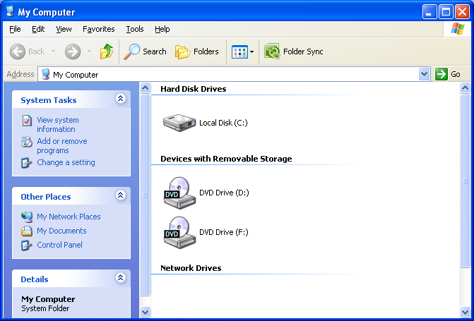
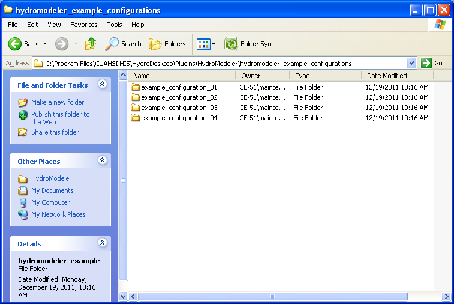
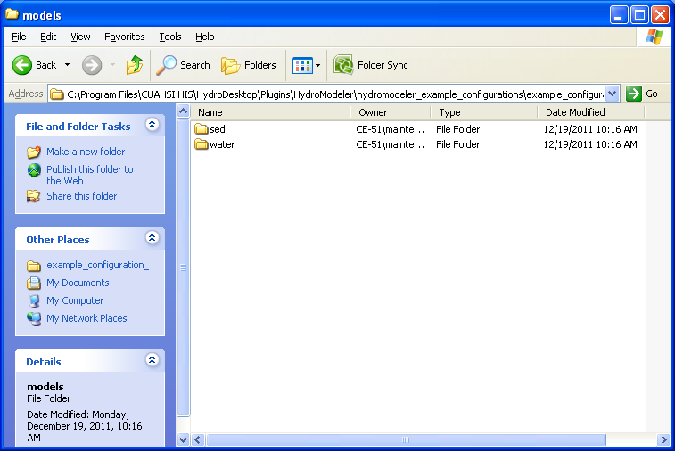
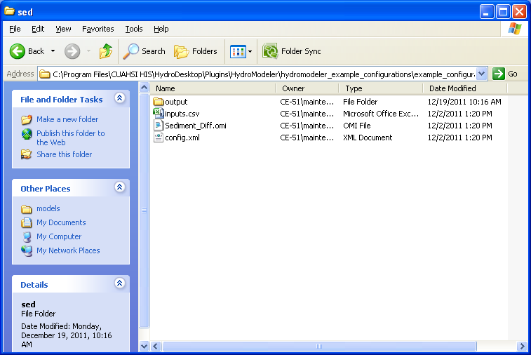

.. index:: ChangingModelInputs

How to Change the Inputs for a Model Component
==============================================

The config.xml file will defines key inputs for a modeling component.  This section shows how to view and edit the config.xml file.

1.	To open the config.xml file, navigate to the modeling project folder using Windows Explorer.

|

 

|

2.	Next navigate through the folders to the specific component you would like to edit.  The figure below is for the Sediment_Diff model from example configuration 3, which is installed with HydroModeler.

|

3.	Open this folder and config.xml file.

|

4.	Open the file with a text editor (a free text editor called Notepad ++ is used in the figure below).

.. figure:: ./images/ChangingInputs/HM_fig5_m1.png
   :align: center

|
5.	This file includes input and output exchange items for the component, as well as other metadata defining the component.  For example the time horizon information, which is near the bottom on the config.xml file, has a TimeStepInSeconds element that controls the time interval on which this particular component steps during a simulation.