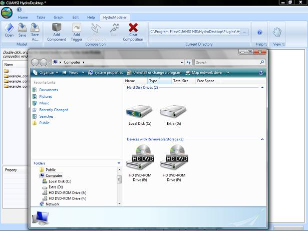
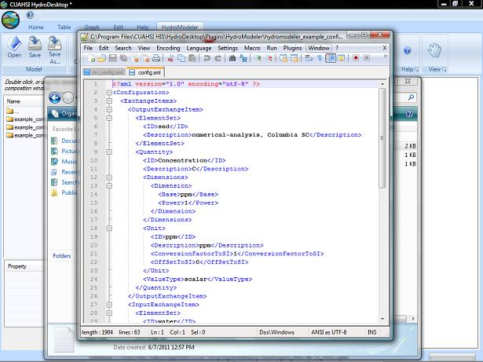

.. index:: ChangingModelInputs

Changing the Input characteristics
==================================

As mentioned in the Key Terms section, the config.xml file will encompass all of the variable information.  In this section, I will show you how to manipulate this file so that you get the desire information associated with the data that will run through your project.

1.	First we will want to open the configuration file.  The Current Directory will default to the example configurations folder imbedded within HydroModeler.  This will be the folder we want to navigate to using Windows Explorer.

 

2.	Now that we have found the example configurations folder, navigate through the folders to the specific component you would like to edit.  I will be using the  Sediment_Diff model from example 3, which is found in the models folder.

3.	Open this folder to display the associated configuration file.

4.	We can edit the configuration file using multiple programs, however, for the sake of saving time and possibly money, I will be using notepad to access this file.   The only downside to using notepad is the information is not formated like shown in Key Terms and can be quite difficult to read at times.

5.	Right click on the configuration file and select Open With and then select notpad.  You should now see the following screen.

6.	Now imagine that the data we have is at 5 second intervals.  Towards the bottom, we can find the time horizon information.  At the bottom of this segment is the TimeStepInSeconds branch.  Currently, this is defaulted to 1 second.  However if our information is taken at 5, like previously mentioned, we will need to change this value from 1 to 5 so that the component is processing our data correctly.

7.	There are a number of characteristics that we can change, but you want to be sure of what you are editting.  Changing the wrong thing has the possiblity of causing the component to work incorrectly while using it in HydroModeler.  One thing you will not want to change is the Quantity ID.  This information is utilized in the programming in HydroModeler and if this is changed then HydroModeler may not be able to find the specific aspect of this variable.  This could cause an error message within HydroModeler or worse, causing data not to be set correctly and outputting incorrect information.