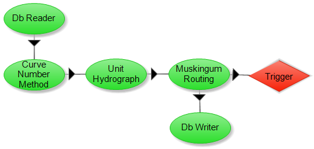

.. index:: ExConfig1

.. role:: raw-latex(raw)
    :format: latex html

.. raw:: html

	

Example Configuration 1 - Smith Branch
======================================

The major purpose of this configuration is to find the streamflow at the Smith Branch watershed outlet using a given amount of rainfall.  The rainfall is imported from the HIS database using the DbReader method.  This data is then sent to the Curve Number Method, which can estimate the infiltration of water that occurs in the soil.  This method uses existing conditions such as land use, soil type, and antecedent soil conditions to get an approximation for the excess rainfall.  This newly calculated data is now sent to the Unit Hydrograph method.  This method takes the new data and computes an estimated streamflow of an outlet for a specific subbasin.  The streamflow for each of these outlets are then exported to the Muskingum Method so that a channel network can be applied to determine the streamflow to the watershed outlet.  DbWriter will then store this information.

The following equations are used in the estimation of excess rainfall using the Curved Numbers Method.  The excess precipitation can be obtained using equation 1.  Equation 2 is a conceptual model used to approximate the continuing abstraction.  Equation 3 is an empirical formula for soil water storage.  Equation 4 is an estimation of the initial abstraction using an empirically derived relationship.

.. raw:: latex html

	\[P_e = P-I_a-F_a\]

.. raw:: latex html

	\[F_a = \frac{S(P-I_a)}{P-I_a+S}\]

.. raw:: latex html

	\[S = \frac{1000}{CN}-10\]

.. raw:: latex html

	\[I_a = 0.2S\]

.. Note::

	Where :raw-latex:`\((P_e)\)` is the excess precipitation, :raw-latex:`\((P)\)` is the precipitation, :raw-latex:`\((I_a)\)` is the initial abstraction, :raw-latex:`\((F_a)\)` is the continuing abstraction, :raw-latex:`\((S)\)` is soil water storage, and :raw-latex:`\((CN)\)` is the curve number parameter.

The following equations are used in the estimation of the streamflow for an outlet.  Equation 1 is used to obtain the lag time.  Equation 2 estimates the peak flow rate.  Equation 3 defines the peak flow.  Equation 4 uses the excess precipitation and instantaneous unit hydrograph to solve for the direct runoff hydrograph.

.. raw:: latex html

	\[t_p = 0.6t_c\]

.. raw:: latex html

	\[q_p = \frac{483.4A}{T_p}\]

.. raw:: latex html

	\[T_p = \frac{t_r}{2}+t_p\]

.. raw:: latex html

	\[Q_n = \sum_{m=1}^{n\le M}P_{e,m}U_{n-m+1}\]

.. Note::

	Where :raw-latex:`\((t_p)\)` is the lag time, :raw-latex:`\((t_c)\)` is the time of concentration, :raw-latex:`\((q_p)\)` is the peak flow rate, :raw-latex:`\((A)\)` is the watershed area, :raw-latex:`\((T_p)\)` is the peak flow, :raw-latex:`\((t_r)\)` is the rainfall duration, :raw-latex:`\((Q_n)\)` is the direct runoff hydrograph, :raw-latex:`\((P_{e,m})\)` is the excess precipitation at time :raw-latex:`\(m\)`, and :raw-latex:`\((U_{n-m+1})\)` is the unit hydrograph ordinate at current index :raw-latex:`\(n-m+1\)`.

The following equations are used in the estimation of the streamflow at the watershed outlet.  In Equation 1, the total water storage in a channel is computed using wedge and prism volumes.  The wedge volumes account for the back water or flood wave effects.  The prism volumes account for the volume of the water residing in the cross sectional area of the channel.  Equation 1 can be simplified to equation 2 by the assumption that the storage can be expressed as a function of the weighting factor and proportionality coefficient.

.. raw:: latex html

	\[S_{j+1}-S_j = \frac{I_j+I_{j+1}}{2}\Delta t-\frac{Q_j+Q_{j+1}}{2}\Delta t\]

.. raw:: latex html

	\[Q_{j+1} = C_1I_{j+1}+C_2I_j+C_3Q_j\]

.. Note::

	Where :raw-latex:`\((S)\)` is the total storage at times :raw-latex:`\(j\)` and :raw-latex:`\(j+1\)`, :raw-latex:`\((I)\)` is the inflow at times :raw-latex:`\(j\)` and :raw-latex:`\(j+1\)`, :raw-latex:`\((Q)\)` is the outflow at times :raw-latex:`\(j\)` and :raw-latex:`\(j+1\)`, and :raw-latex:`\((C_1)\)`, :raw-latex:`\((C_2)\)`, and :raw-latex:`\((C_3)\)` are functions of the weighing factor, proportionality coefficient, and the change in time.