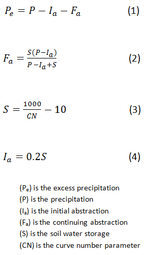

.. index:: ExConfig2

.. role:: raw-latex(raw)
    :format: latex html

.. raw:: html

	

Example Configuration 2 - Penman-Monteith
=========================================

The primary purpose of the Penman Monteith method is to calculate the loss of water from land surfaces due to evaporation.  This method is designed off of the ASCE Penman Monteith approximation.  This method is better at describing evapotranspirtation that other "open-water" evaporation equations because it considers transpiration as well as evaporation.  We will be refering to the newer version of this model known as the standard reference evapotranspiration equation.  Because net solar radiation and evapotranspiration are data that can be reused for other calculations, they have been seperated into a different components.

The first equation is the ASCE standardized reference evapotranspiration equation used to find the evapotranspiration.

.. raw:: latex html

	\[ET_{sz} = \frac{\frac{1}{\lambda\rho_w}\Delta(R_n-G)+\gamma\frac{C_n}{T+273}u_2(e_s-e_a)}{\Delta+\gamma(1+C_du_2)}\]

.. Note::

	Where :raw-latex:`\((ET_{sz})\)` is the standardized evapotranspiration, :raw-latex:`\((R_n)\)` is the net radiation, :raw-latex:`\((G)\)` is the soil heat flux, :raw-latex:`\((T)\)` is the daily average temperature, :raw-latex:`\((u_2)\)` is the daily average wind speed, :raw-latex:`\((e_s)\)` is the saturation vapor pressure, :raw-latex:`\((e_a)\)` is the mean actual vapor pressure, :raw-latex:`\((\Delta)\)` is the slope of the saturation vapor pressure - temperature curve, :raw-latex:`\((\gamma)\)` is the psychometric constant, :raw-latex:`\((C_n)\)` and :raw-latex:`\((C_d)\)` are constants based on crop reference type and simulation time step, :raw-latex:`\((\lambda)\)` is the latent heat of vaporization, and :raw-latex:`\((\rho_w)\)` is water density.

The following equations show how the net solar radiation was calculated.  The second equation is the main equation for the net radiation.  Equation 3 is used to find the short wave radiation.  Equation 4 is used to find the long wave radiation.  Equation 5 is used to find the extraterrestrial radiation.  Equation 6 is used to find the cloudiness factor.  Equation 7 shows the relative solar radiation and can have values ranging from 0.3 to 1.0.

.. raw:: latex html

	\[R_n = S_n + L_n\]

.. raw:: latex html

	\[S_n = (1-\alpha)R_s\]

.. raw:: latex html

	\[R_s = T_fR_a\]

.. raw:: latex html

	\[L_n = \frac{-c_f\sigma(0.34-0.14\sqrt{e_a})(T_{kmax}^4+T_{kmin}^4)}{2}\]

.. raw:: latex html

	\[c_f = 1.35\frac{R_s}{R_{s0}}-0.35\]

.. raw:: latex html

	\[\frac{R_s}{R_{s0}} = \frac{T_f}{0.75+2\times10^{-5}z}\]

.. Note::

	Where :raw-latex:`\((R_n)\)` is the net radiation, :raw-latex:`\((S_n)\)` is the short wave radiation, :raw-latex:`\((L_n)\)` is the long wave radiation, :raw-latex:`\((\alpha)\)` is the canopy coefficient held constant at 0.23, :raw-latex:`\((R_s)\)` is the incoming solar radiation, :raw-latex:`\((T_f)\)` is the atmospheric transmittance, :raw-latex:`\((R_a)\)` is the extraterrestrial radiation, :raw-latex:`\((c_f)\)` is the cloudiness factor, :raw-latex:`\((\sigma)\)` is the Stefan-Boltzmann constant, :raw-latex:`\((T_{kmax})\)` is the maximum temperature, :raw-latex:`\((T_{kmin})\)` is the minimum temperature, and :raw-latex:`\((R_{s0})\)` is the clear sky radiation.