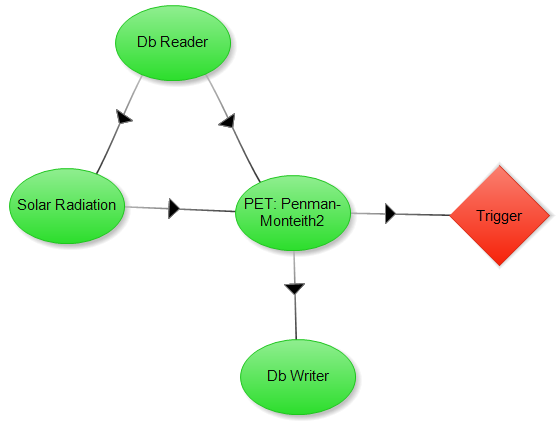

.. index:: ExConfig2

Example Configuration 2 - Penman-Monteith
=========================================

The primary purpose of the Penman Monteith method is to calculate the loss of water from land surfaces due to evaporation.  This method is designed off of the ASCE Penman Monteith approximation.  This method is better at describing evapotranspirtation that other "open-water" evaporation equations because it considers transpiration as well as evaporation.  We will be refering to the newer version of this model known as the standard reference evapotranspiration equation.  Because net solar radiation and evapotranspiration are data that can be reused for other calculations, they have been seperated into a different components.

The first equation is the ASCE standardized referencce evapotranspiration equation used to find the evapotranspiration.

The following equations show how the net solar radiation was calculated.  The second equation is the main equation for the net radiation.  Equation 3 is used to find the short wave radiation.  Equation 4 is used to find the long wave radiation.  Equation 5 is used to find the extraterrestrial radiation.  Equation 6 is used to find the cloudiness factor.  Equation 7 shows the relative solar radiation and can have values ranging from 0.3 to 1.0.

