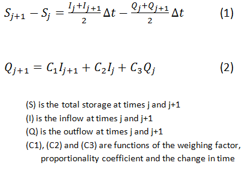

.. index:: ExConfig3

.. role:: raw-latex(raw)
    :format: latex html

.. raw:: html

	

Example Configuration 3 - Bidirectional Link
============================================

.. figure:: ./images/ExampleConfig/HM_fig3.png
   :align: center

Example configuration 3's primary objective is to solve for the concentration of a contaminant in a river and its riverbed by simultaneously solving for both the soil and the water concentrations using a bidirectional link.  To do this, the process is broken up into two seperate components.  The two components are the water advection and sediment diffusion models.  Advection is generally associated with the lateral movement of the contaminant and diffusion with the infiltration into the soil.  The water advection model is comprised of movement in both the x and z direction.  The sediment diffusion model is only concerned with contanimants moving in the z direction.  A clearer representation of this is given in the image below.  The flow velocity and diffusion coefficients are required to help use determine the level of contamination in the soil and water.

These two components are both derived from the equation shown below.  D represents the diffusion coefficients in the x and z directions.  u represents the velocity in the x direction and v represents the velocity in the z direction.

.. raw:: latex html

	\[\frac{\partial C}{\partial t} = D_x \frac{\partial^2C}{\partial x^2}+D_z \frac{\partial^2C}{\partial z^2} - u \frac{\partial C}{\partial x} - v \frac{\partial C}{\partial z}\]

To obtain the equation for the water advection component, we only concern ourselves with the x and z direction since we assume that the dominate means of contaminant transportation is advection in the x direction and diffusion in the z direction.

.. raw:: latex html

	\[\frac{\partial C_w}{\partial t} = D_{w,z} \frac{\partial^2C_w}{\partial z^2} - v \frac{\partial C_w}{\partial x}\]

We use similar assumptions to help us derive the sediment diffusion component.  Only concerned with the diffusion in the z direction, we can reduce the equation as follows.

.. raw:: latex html

	\[\frac{\partial C_s}{\partial t} = D_{s,z} \frac{\partial^2C_s}{\partial z^2}\]