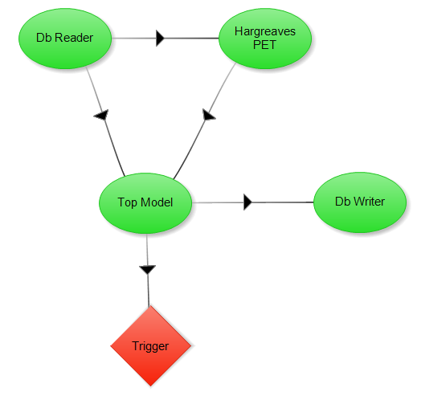
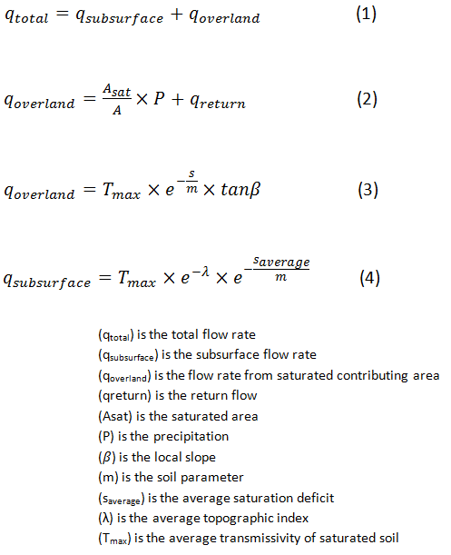

.. index:: ExConfig4

Example Configuration 4 - TOPMODEL
==================================

This example configuration was created using the conservation of mass equation, which states that the inflow rate minus the outflow rate equals the rate of change in the storage, and Darcy's law, which can be used to calculate the water flow rate through soil.  The TOPMODEL component is also dependent upon the Topographic Index(TI), which is derived from the analysis of the watershed topography by using Terrain Analysis Using Digital Elevation Models(TauDEM).

Located below are the equations used to model the TOPMODEL component.  The first equation determines the total flow rate.  Equations 2 and 3 are used to determine the overland flow rate.  Equation 4 determines the subsurface flow rate.

