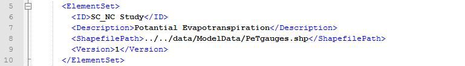

.. index:: KeyTerms

Key Terms
=========

These are important terms to remember when using HydroModeler.  This first segment focuses on the terminology found by simply using HydroModeler.  HydroModeler also leaves room for development of your own components, so the second portion covers terminology found when creating your own models.

Using HydroModeler
------------------
These terms will give you a general understanding of some of the file formats that are used in HydroModeler.

+ ***.omi file:**

*OpenMI model file*.  These will be the models and tools you can use to help compile your projects.  Each of these components will run a different method that will be used to process the desired data you need.  A breif explanation of the methods found in the pre-existing models can be found in the following page.  If you have access to the appropriate programing software, you also have the ability to develop your own model components.

This is what a .omi file looks like when loaded into HydroModeler.

.. figure:: ./images/KeyTerms/HM_fig1.png
   :align: center

+ ***.opr file:**

*OpenMI project file*.  After compiling and linking all the models and tools in your project, your project will be saved with the following extension.  This will be helpful to you in the future once you begin creating projects as you will not need to recreate a specific setup of components and links.  Analysis of hydrological data will more than likely require multiple iterations and having these .opr files saved will prevent you from wasting a lot of time reproducing these projects.

This is what a .opr file looks like when loaded into HydroModeler.

.. figure:: ./images/KeyTerms/HM_fig2.png
   :align: center

Development
-----------
These terms are for advanced users that wish to create and implement their own models.  Visual Studio is the primary software used in the development of HydroModeler, but there are a number of other programming software that can be utilized.

+ ***.dll file:**

*Dynamic link library file*.  The primary purpose of these files is to help facilitate the processes of your computer by providing the required functions and data needed from each individual model.  When you run a project from HydroModeler, it will call the model files contained within the project.  The .dll will retrieve the required information from the model components and return it back to the main processes.  Each of these model componenets will have their own .dll files.  The benifits behind using .dll files is so that multiple programs can access a models information as well as speeding up the processes of your computer by running only when its associated model is present in your project.

+ **SMW:**

*Simple Model Wrapper*. This is an approach for creating OpenMI model components that simplifies the OpenMI interface, which in turn, allows you to create your own components with ease by reducing the amount of code required.  The Simple Model Wrapper will reduce the required number of methods from 19 to 3.  When designing your components, they will consist of three methods, called Initialize, Preform Time Step, and Finish.  Initialize will set up the model with initial conditions, units, and system parameters.  Perform Time Step will take all the initialized information and process it to output your calculated values.  It will return these values so that they may be accessed by other components.  The Finish method will close out any files opened to retrieve any information, for example, the configuration file.  This method helps to conserve computer memory and allow processes to run faster.

+ **config.xml file:**

*Model configuration file when using Simple Model Wrapper*.  These files store all the information about the data, including a description of the data, it's conversion factor, and it's units.  The benifit to using configuration files is that when the data changes, components to not need to be recompiled.  Double Clicking these files will allow you to view them through Internet Explorer.  For simple viewing purposes, this is the best program to use because it will color code the syntax, making the file much easier to read.  However, internet explorer will not allow you to edit the files and you mush use a seperate program for editting.  Notpad is the best way to achieve this as it is free.  However, using just notepad makes it diffucult to view these files because there is no color coding, but there is an extened version of notepad you can download called Notepad++ which can be obtained here  http://notepad-plus-plus.org/download

This is a configuration file opened using Internet Explorer.

.. figure:: ./images/KeyTerms/HM_fig3.png
   :align: center

This is a configuration file opened using Notepad++.

.. figure:: ./images/KeyTerms/HM_fig4.png
   :align: center

+ ***.shp file**

*Shapefile.*  This file is used to graphically describe your data using points, polylines, or polygons.  A shapefile can be included in your configuration files and subsequently read by the HydroModeler plug in.  A .shp file is not required and is also not the only format that can be used.  An alternative would be to use an ASCII files.  HydroModeler has a build in viewer that can display this graphical representation and is called the ElementSetViewer, which you can find more information about in the Linking Components section of the HydroModeler help files.

This is an example of a .shp file that has been added to a configuration file.

This is an example of .shp files resulting image, created using HydroModeler's ElementSetViewer.

.. figure:: ./images/KeyTerms/HM_fig6.png
   :align: center