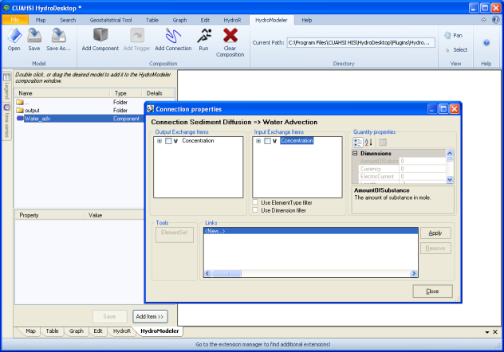

.. index:: LinkingModels

How to Link Models into a Configuration
=====================================

The purpose of linking the models together is to transfer data back and forth between models so that you are able to calculate the required data for your project.  In this demonstration, we will be recreating example configuration 3.
   
1.	To link models together, we first need to place a few models within the HydroModeler plugin in HydroDesktop.  Navigate to the model folder within example_configuration_03.  Inside these folders you will find the Sediment_Diff and Water_adv .omi files.  Add these to your project.

2.	Next, you will want to add a trigger.  Locate the Composition panel of the ribbon toolbar and click Add Trigger.

3.	Now that our components have been place, we can begin to link them together.  Find the Add Connection button located at the top in the main ribbon.  First click your starting model and then click again on the model you wish for your link to end.

4.	For some intances, you may have a project that needs the link to work in both directions.  You can repeat the above directions but switch the order in which you click the models.

5.	You may link as many models and in any direction as you wish but note that the trigger can only function as a terminal end to a link and only one model may be linked to it.

6.	Once the link has been made, you need to modify it to determine what information will be conveyed through the link.  To do this, click the link to access the Connection Properties.

7.	You will see two boxes, one labeled Output Exchange Items and one labeled Input Exchange Items.  Expand the desired input and output variables you would like for the model to utilize and select the appropriate location.  The location can be found as a subset of a selected variable.

8.	Note that within the location branch, there are Element Mappers.  These are built in functions to help you mediate your data if they do not overlay eachother.  More than likely, you will not need to check anything here.  To confirm that your data is appropriate, you may click the ElementSet button to display a visual representation of your data.

9.	Now click apply and notice that a link has been created in the links box.  Different links can be created and stored in the links box and you can apply or delete them as you see fit.

10.	Your have created your link and you can exit the Connection Properties dialog box by clicking close.