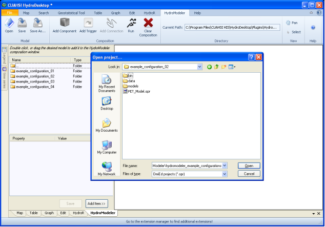

.. index:: OpeningOprFile

How to Open an OpenMI Project File
==================================

A simple model configuration can be created and executed using freely available model components provided by the HydroDesktop community.  This section describes how to access the pre-developed model components built in to HydroModeler.  If you have downloaded a stable release of HydroDesktop, a few preset example configurations will be available to you and displayed in the left hand box of the HydroModeler window. 
Within each of these example configurations exist a "bin" folder, which contains all of the libraries needed to run the model, a "data" folder, which contains all of the necessary input files for each model component and a "models" folder, which contains files pertaining to each individual model components.

1.	Open Hydrodesktop and load the HydroModeler plug in.

|

2.	If none of the example configurations are present in the left hand box, look to the top of the page and find an area labeled Current Directory.  Click the button to the right of the text box and navigate to the following directory.

**Program Files/CUAHSI HIS/HydroDesktop/Plugins/HydroModeler/hydromodeler_example_configuration**
*(Note that the exact location will vary slight, based on where you installed HydroDesktop)*

|

3. 	Once the example configurations are displayed, you can navigate into the folders to find the .opr files for the preset configuration you are looking for.  You can double click, click and drag, or click the Add Item button to display the configuration.

|

4. 	After the configuration has been loaded, you are free to manipulate and run the configuration as you see fit.
