.. index:: Part 2 - Adjusting Model Input

Part 2 - Adjusting Model Input
=====================================================

Data
----
   
All of the necessary data can be retrieved from online sources and manipulated using standard ArcInfo tools.  The necessary data for this section is listed below.

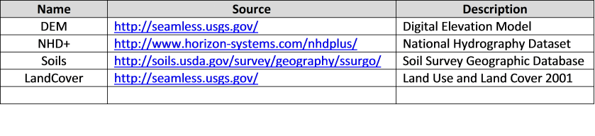
  

.. index:: 
   single: Defining a Watershed
   single: Watershed
   single: ArcMap

Defining a Watershed
---------------------

1. Open ArcMap and add the elevation DEM that you have downloaded for the region of interest.   Below is a typical elevation map.

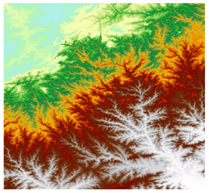

For example, if your area of interest were Smith Branch in Richland County SC, you would locate this stream on the USGS seamless server map.  On the right of the screen select the Download button and check the boxes for NCLD landcover and 1" NED elevation.  On the left side of the screen under the Download tools select the "Define Rectangular Area" tool and draw a rectangle over the desired region to be downloaded.  Download both zip files to your working directory and extract data.

2. Convert this DEM into a projected coordinate system rather than its default geographic coordinate system.  This is done using the Project Raster tool which can be found within the ArcToolbox.  

For the Smith Branch DEM the projected coordinate system used is NAD 83 State Plane for South Carolina.

3. Next, any "sinks" within the DEM must be filled to ensure that water will not accumulate at any cell within the elevation grid.  Use the Fill tool within the ArcToolbox.  The output raster will only have minor changes.  Name this file Fill

4. From the ArcToolbox, select Spatial Analyst Tools - Hydrology - Flow Direction.  This tool determines the direction water will flow from each elevation cell.  Supply Fill as the "Input surface raster", and save the resulting flow direction raster as Fdr. The output will look similar to map below, where values range from 1 to 128.

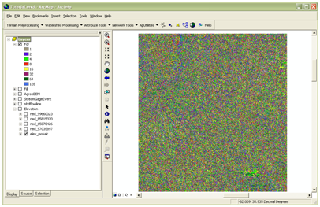

5. From the ArcToolbox, use the Spatial Analyst Tools - Hydrology - Flow Accumulation tool to calculate how many contributing pixels each element in the raster has.  This is useful in determining where water will accumulate after a rain event.  Use Fdr, created in the last step, as this "Input flow direction raster", and save the output accumulation raster as Facc.  

The map below shows how Smith Branch appears after using the Flow Accumulation tool. 

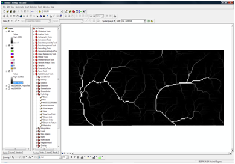

6. Next, we will need the data downloaded from the National Hydrology Dataset (NHD).  If  you have this data downloaded proceed to step 7.  Otherwise follow the link provided in Table 1 to the NHD website.  Select the NHDPlus data tab listed on the left.  This will take you to a map of the US broken down into regions.  Select the appropriate region.  At the bottom of the next page there will be several zip file available for downloading.  Please download the following: Catshape, Cat_Flowline_Attr, NHD, and StreamGageEvent.  Extract the data from all file into your working directory.  

7. Now, using the USGS gage stations supplied within the NHD+ data we can  select an appropriate outlet point for our watershed.  Load StreamGageEvent.shp into the project (the picture below shows the file for the South Atlantic Gulf region of the US where Smith Branch is located).  

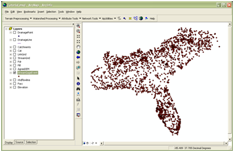

8. Once you have determined a suitable outlet point, select the point using the "Select Features Tool".  Next, right click on StreamEventLayer.shp and select Data - Export Data. Be sure to export only the selected features.  Name this point Outlet.shp.  After creating outlet.shp converted it to a projected coordinate system rather than its default geographic coordinate system.

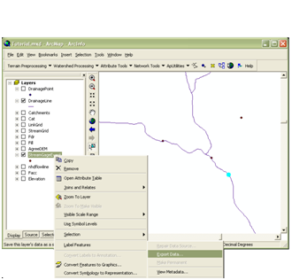

9. Within the ArcToolbox, use Spatial Analyst Tools - Hydrology - Snap Pour Point to make sure that this outlet point is positioned on a location of high accumulation.  Specify Outlet.shp as the "Input feature pour point data", COMID as the "pour point field" and Facc as the "Input accumulation raster".  Be sure to select as reasonable "Snap Distance" (maximum distance the point will be allowed to move from its original position).    To determine a good snap distance use the ruler and measure from the outlet point to the flowline.  Save the output as OutletSnap.  Once the outlet snap is created verify that the snap is on the flow path of the Facc and is near the desired outlet point.

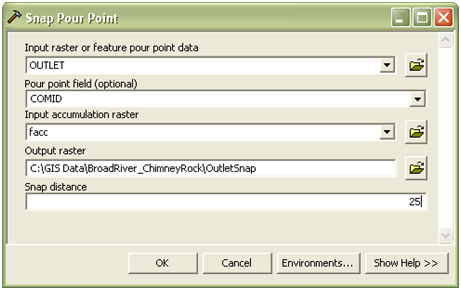

10. Define the watershed boundary using Spatial Analyst Tools - Hydrology - Watershed. Supply Fdr and OutletSnap as inputs, save the output as Watershed  

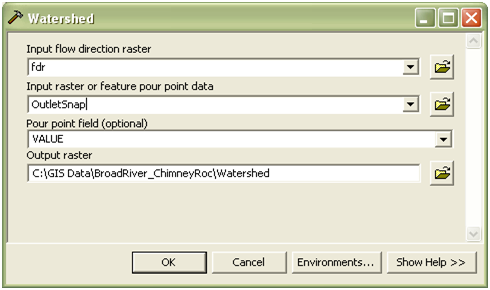

At this point the entire watershed should be visible within the DEM that was downloaded.  If the watershed is larger than the DEM, the elevation and landcover data should be downloaded again defining a larger rectangle around the area of interest.

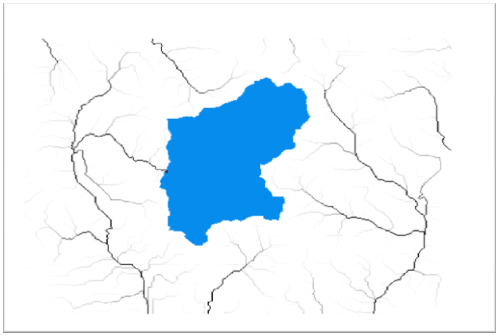

11. From the ArcToolbox use Conversion Tools - From Raster - Raster To Polygon to convert the watershed raster into a feature class.  Name the output file Watershed.shp.

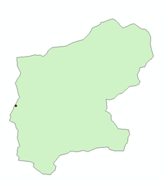

12. Next, the subbasin features must be delineated.  There are several methods for doing this, but for simplicity we'll use the catchments that have already been delineated within the NHD Plus data set.  Load the catchments.shp file located within the NHD+ download. Reminder: The catchment file is large; stay zoomed into the area of interest and for faster loading. 

13. Selection - Select by location, all features from catchments.shp that intersect with Watershed.shp.  Right click on catchments.shp and select Data - Export Data (export selected features).  Save this output as Subbasins.shp.
   
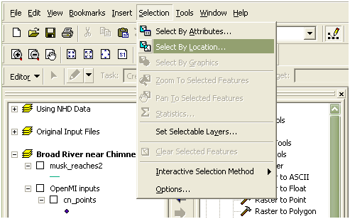

14. From the NHD+ dataset, load NhdFlowline.shp.  

15. Join Subbasins.shp with NhdFlowline.shp based on ComID (keep only matching records).  This will select only the streams corresponding to the desired subbasins.  Right click on NhdFlowline.shp and select Data - Export Data (only selected features).  Save this as Reaches.shp.  NOTE:  Make sure that there are an equal number of subbasins and stream elements in Subbasins.shp and Reaches.shp, respectively. 

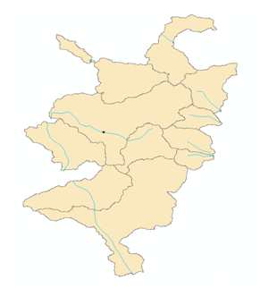

16. Add the NHDFlowlineVaa.dbf (part of the NHD+ dataset) table to the project.  This table contains information about how the reaches are related.  Right click on Reaches.shp and select Joins and Relates - Join.  Specify COMID as the field to be joined on and NHDFlowlineVaa.dbf as the table to join. Make sure to select "keep only matching records".  

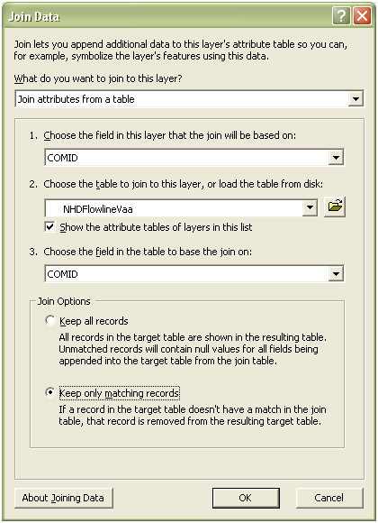

17. Add FlowlineAttributesFlow.dbf (part of the NHD+ dataset) table to the project.  This table gives us some flow characteristics of each reach.   As was done in the previous step, Join this table, based on COMID, to Reaches.shp.  Make sure to select "keep only matching records".  

.. index:: 
   single: Creating Component Inputs
   single: Curve Number

Creating Component Inputs
--------------------------

The SCS Curve Number Component:
''''''''''''''''''''''''''''''''

This component requires one shapefile with the following attribute table.  The shapefile can contain polygon or point features, each of which represents a subbasin within the element set.  Each row must contain a unique Watershed ID, and a weighted Curve Number.

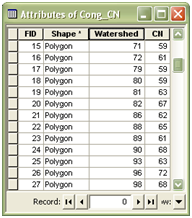

The following steps explain how to create this input file.  The land cover data was downloaded at the same time as the DEM during step 1 of Defining a New Watershed.  You will also need the soil data that can be downloaded from the Soil Survey Geographic Database.  The link for the Soil Survey Geographic Database can be found in Table 1.  Once the page is open select Soil Data Mart.  Follow instructions and the available soil survey will be provided to you for downloading. 

1. Load SoilData.shp and LandCoverData.tif into the project.  The soil map can be found under the spatial directory of the Soils download, and the land cover data is specified within its download directory.  

2. Use the Analysis Tools - Extract - Clip to extract the soil data that overlaps the watershed.   The input features are Soils.shp and the clip features are Watershed.shp.  Save the output as Soil.shp

3. LandCoverData is a raster and needs to be extracted by mask.  Use Spatial Analyst Tools - Extractions - Extract by Mask.  The input raster is LandCoverData.tif and the feature mask is Watershed.shp.  Save the output as LandCov. 

.. figure:: ./images/HM_fig23.png
   :align: center

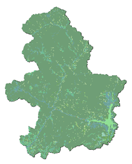

4. Next, we need to prepare the muggatt.dbf data before we add it to our project.

a.	Within the soil data that you downloaded from the Soil Survey Geographic Database and you should a file called soildb_US_2002.zip.

b.	Extract this file,you should now have soildb_US_2002.mdb.

c.	 Open soildb_US_2002.mdb with Microsoft Access.

d.	 If dialog box pops up asking you to "Stop All Macros", click it. Then you should see a bar below the Microsoft ribbon toolbar that says "Security Warning ..." Click on "Options..." and select "Enable this content" then click OK.

e.	Enter the path where the tabular files reside, for example c:/temp/gsmsoil_sc/tabular. This will put the data from the database into the shapefiles.

5. Join muaggatt.dbf to Soil.shp, based on MUKEY.  Muaggatt.dbf can be found in Soildb_US 2002.mdb, included in the download.  Be sure to select "keep only matching records".

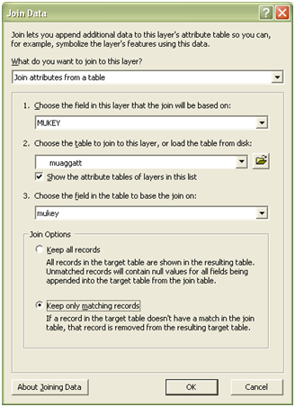

6. Create a new column in the soil attribute table named SoilGrp of type Short Integer, then use the field calculator to convert the values of A,B,C,D to 1,2,3,4. This can be done using a Visual Basic command like the one shown in the figure below. 

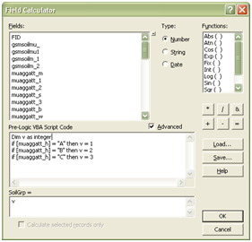

7. Convert Soil.shp into a raster using the Conversion Tools - To Raster - Polygon to Raster, specify SoilGrp as the value field.  The result is a raster soil map representing the soil group numerically.  Save the output grid as Soils.

8. Multiply the LandCov by 100, using 3d Analyst - Raster Math - Times from the ArcTool box.   Save the output raster as LC100.

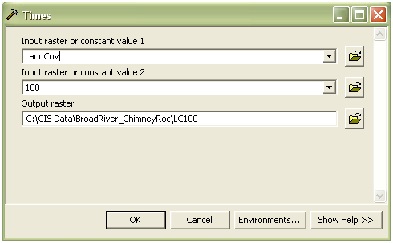

9. Using 3d Analyst - Raster Math - Plus, add LC100 and Soils together to form a composite land use / soil raster.  Name this output LC_plus_Soil.

10. Next, remap these unique land uses and soil IDs to their corresponding Curve Numbers.   Curve numbers must be determined by referencing TR-55 and NCLD 2001.  Once Curve Numbers have been chosen there are two options for reclassifying.                                                              Option 1: Using 3d Analyst - Raster Reclass - Reclassify by Table.  The input table should look similar to the one shown below, where the X column contains unique land cover/soil identifiers, and Y are their corresponding curve numbers.  Be sure to check the box "change missing values to NoData".  (This is just an example, the actual list should have all land cover / soil id's)  Name this output CnGrid.

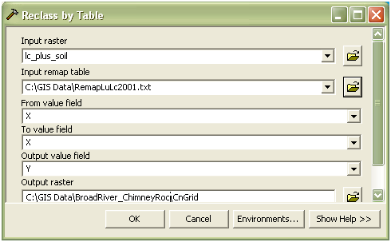

Option 2: Use the Reclasify (3d) tool and enter the predetermined curve number as a new value.  This method is good for one use only.  If curve numbers are changed all values will have to been reentered.

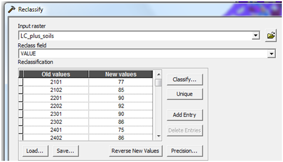

11. Create a new field in the Subbains.shp attribute table, named ID.  Using the field calculator, set its value equal to FID.  

12. Next, we need to summarize this data based on the Subbasins.shp.  To do this use Spatial Analyst Tools - Zonal - Zonal Statistics As Table.  The zone data will be Subbasins, zone field is ID, and the value raster is CnGrid.  Make sure that "ignore NoData in calculations" is checked.  This produces a table containing weight averaged curve numbers, for each subbasin.   Save the output table as CnTable.dbf.

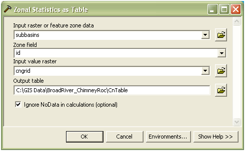

13. Right click on Subbasins.shp and select  Joins and Relates - Join.  Join this layer based on ID, to CnTable.dbf based on VALUE.  Be sure to check the box "Keep only matching records".

14. Next, right click on the Subbasins.shp again and select Data - Export. Save this output layer as CnSubasins.shp.

15. Add two new fields to CnSubasins.shp : CN (type of short integer) and Watershed (type of long integer).   

16. Right click on the Watershed column and select Field Calculator.  Enter [COMID] in the lower box, then click OK.  After turning off unnecessary fields, the attribute table should look like this.

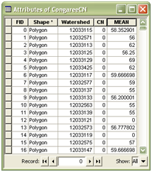

17. Using the field calculator, set the CN column equal to MEAN.  This will automatically round the MEAN values to integers.  After removing the MEAN column, the attribute table should now look like this.

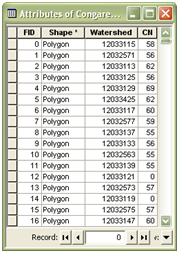

18. Lastly, use Data Management Tools - Features - Feature to Point to convert CnSubasins.shp polygons into a point shapefile.  Name the output file Cn_Points.shp.  This will be the input shapefile for the curve number component. 

.. index:: 
   single: Unit Hydrograph

 
SCS Unit Hydrograph Component:
'''''''''''''''''''''''''''''''

This component requires one shapefile containing point or polygon features.  The attribute table (shown below) outlines the necessary fields.  Area is in units of mi^2 and Tc is in units of minutes

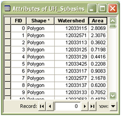

1. Right click on Subbasins.shp and Export the layer as Uh_Subbasins.shp. 

2. In the attributes table for Uh_subbasins create a new column named Watershed (type of Double) and set it equal to COMID using the field calculator. 

3. Create a new column named Area (type of Double).  Right click on this column and select Calculate Geometry. Select Area in Square Miles then OK.  If you are not able to select square miles for the area make sure the map is in a projected coordinate system and not the default geographic coordinate system.

4. Add a new field to hold Time of concentration, Tc, [minutes] (type of double).  These values were calculated outside of ArcMap and then manually entered.  The resulting attribute table is shown below.

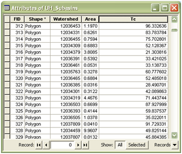

.. index:: 
   single: Muskingum Component

Muskingum Component:
'''''''''''''''''''''

This component requires 1 input shapefile, containing polyline features.  Its attribute table consists of a GridID, TO_NODE, FROM_NODE, K, and X [0<=X<=0.5].  The following steps illustrate how to create this file.

1. Right click on Reaches.shp and export all of the features as Musk_Reaches.shp.  

2. Create a new field called GridID (Type of Long Integer).  Using the field calculator, set it equal to COMID.   After removing unnecessary fields, the attribute table should look something like this.

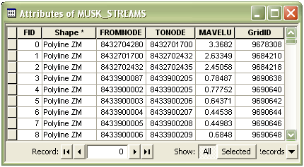

3. Add a new column for the Muskingum weighting factor, X (type of float).  These values should be chosen to satisfy equation stability, and range from 0 <= X <= 0.5, where 0 represents reservoir-type storage and 0.5 represents full wedge storage.  For this exercise these values were entered manually.  The attribute table should now look similar to the one below.

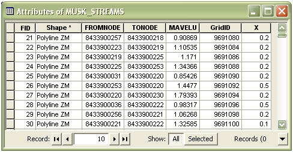

4. Create a new field to hold the features length, called LENGTH (type of double).  Set this column equal to the feature's length, Options - Calculate Geometry - Length [ft].

5. Create a new field for proportionality coefficient, K (type of double).  This can be estimated as the time of travel of a flood wave through the reach.   To estimate this parameter we can divide the feature's length (LENGTH) by the mean annual velocity (MAVELU) and then divide by 3600 to convert into hours.  This will give a rough estimate for reach travel time.

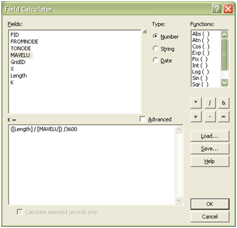

6. Next, create two new columns: To_Node (type of Long) and From_Node (type of Long).  Using the field calculator, set To_Node equal to TONODE and From_Node equal to FROMNODE.  Note: When designating the type as long makes sure the field property precision contains the correct number of digits found in the TONODE and FROMNODE, otherwise the field calculator will not work.  

7. After turning off unnecessary fields, the attribute table should look similar to this:

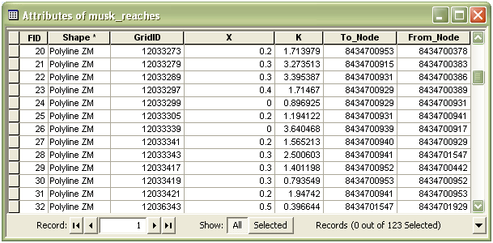

.. index:: 
   single: Creating a New Model Composition

Creating a New Model Composition
---------------------------------

1. Copy all files associated with the three shapefiles that were created in the previous sub-sections (cn_points, uh_subbasins, and musk_reaches) into the HydroModeler example directory.  C:\Temp\HydroModeler_Example_Configuration - data - gis.

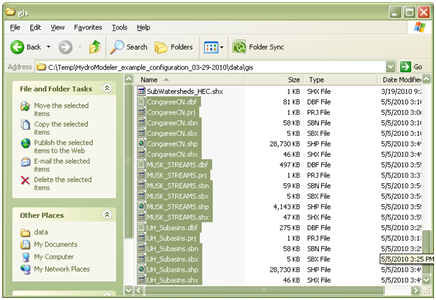

2.  Navigate to C:\Temp\HydroModeler_Example_Configuration - models, and open the configuration files for the Curve Number, Unit Hydrograph, and Muskingum components.  Change the ShapeFilePath element with these files to point to the new shapefiles. For the curve number configuration change the ShapeFilePath to point to the cn_points.shp file, the unit hydrograph should point to the  uh_subbasin.shp file, and the Muskingum should point to the musk_reaches.shp file. 

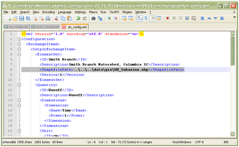

3. Open HydroDesktop and load the HydroModeler Plugin (as outlined in section 2).

4. Right click on the HydroModeler workspace and select Add Model.  Navigate to C:\Temp\HydroModeler_Example_Configuration\models\ and add all three models (Curve Number Model, Unit Hydrograph, and Muskingum Routing).  Also add the DbReader and DbWriter components, which can be found under data - cuahsi-his.

The Db in DbReader and DbWriter stands for database and both are small OpenMI standardized XML files (.omi file).  The DbReader provides the model you are creating access to HydroDesktop database themes as exchange items.  While the DbWriter, allows exchange items to be written to the HydroDesktop database as themes.   

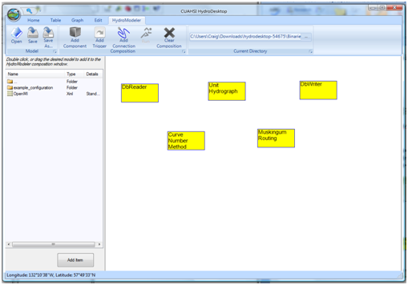

5. Right click in the HydroModeler workspace and select Add Trigger. A Trigger component is necessary to run a simulation.  The Trigger starts the simulation by invoking the action GetValues on the model at a specified time.  This time can be set in the Run Properties window.  

6. Right click in the HydroModeler workspace and select Add Connection. Next, click on the DbReader to assign it as the source component and then click on the Curve Number Method to assign it as the target component.  The Connection establishs a direction for information to flow during the simulation.  Each source component provides the input data to the linked target component whicih accepts data.  Repeat this to establish linkages between all components, refer to the picture below to see how all connections should be established. 

NOTE:  Retrieval of data for the DbReader component is NOT covered.  The remainder of the tutorial assumes that proper rainfall data has been downloaded.

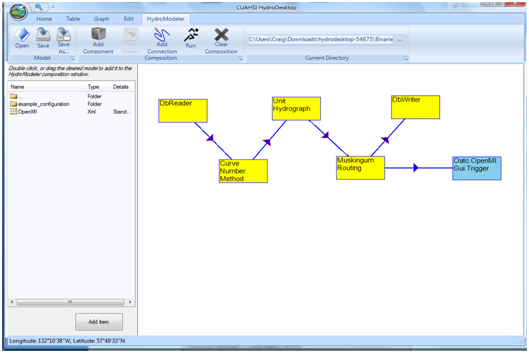

7. Click on each arrow to open a connection properties window.  Define the output exchange item that will be supplied to an input exchange item.  Repeat for all links.

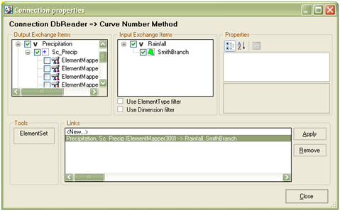

8. Save the model by clicking Save as

9. Right click in the HydroModeler workspace and select Run.

10. Select Set all within Events listened during calculation, click Latest overlapping to determine the simulation end time, and finally click RUN!!

.. index:: 
   single: Component Definitions

Component Definitions
----------------------

SCS Curve Number Method - Input Files

\*.OMI:
 

Shapefile input (each row =1 element):

SCS Unit Hydrograph Method - Input Files

\*.OMI:

.. figure:: ./images/HM_table5.png
   :align: left

Shapefile input (each row =1 element):

Muskingum Method - Input Files

\*.OMI:

Shapefile input (each row =1 element):

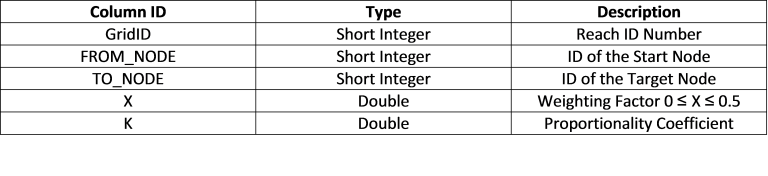

DbReader:

\*.OMI:

DbWriter:

\*.OMI:

Green Amp Infiltration:

\*.OMI:

Shapefile input (each row =1 element):

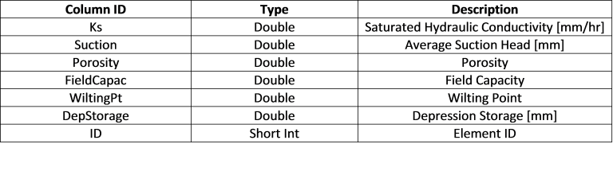

