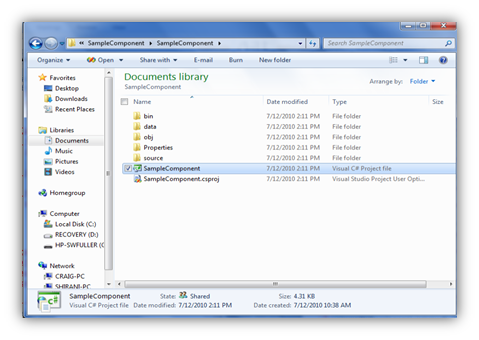
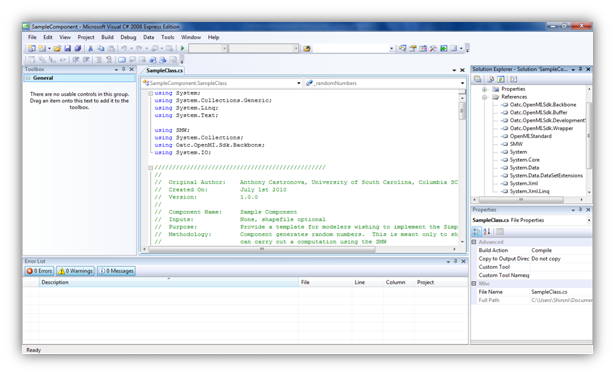
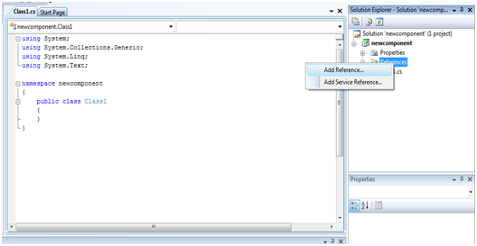
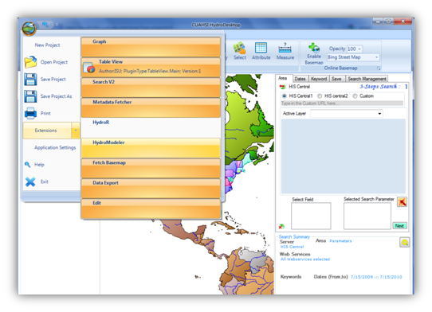
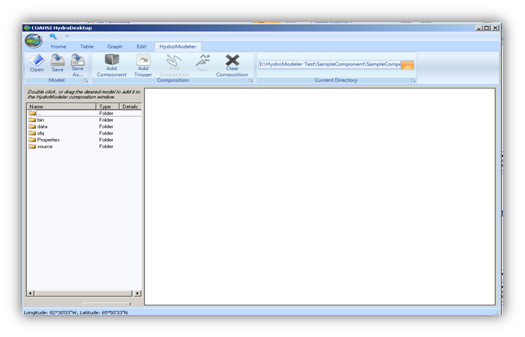
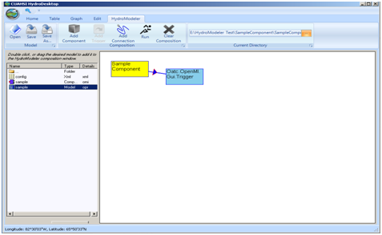
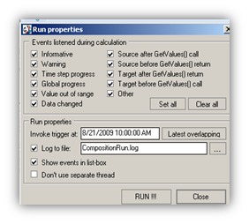
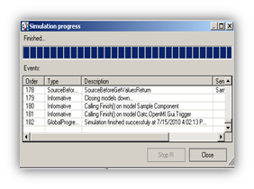

.. index:: Part 3 - Creating a Component 

Part 3 - Creating a Component 
=============================
   
Up to this point we have run an example stimulation in HydroDesktop and created a new model composition in ArcMap.  In this section we will walk through a sample component to gain an understanding of how creating a specialized component in Visual Studio C# can be useful.  The sample component is a shell of how code should be written to run in HydroDesktop.  This component can be modified by the user to run more meaningful hydrological applications.    

C# is an object oriented programming language designed for building a wide variety of applications that run on the .NET Framework.  The .NET Framework is a Windows component that supports building and running of applications and Web services.  The key components of the .NET Framework are the common language runtime and the class library.  The class library is a collection of classes, interfaces, and value types that are included in the Microsoft .NET Framework.  The class library is designed to be the foundation on which the .NET Framework applications, components, and controls are built. 

.. index:: 
   single: Microsoft Visual C#
   single: C#

Getting stared with Visual C#
------------------------------

1. If you do not have access to Microsoft Visual Studio you can download Microsoft Visual C# 2008 for free from http://www.microsoft.com/express/Downloads/

2. Choose the tab Visual Studio 2008 Express.  Then select Visual C# 2008 Express Edition.  Click Download and follow instructions to install.

.. figure:: ./images/HM_fig44.png
   :align: center

3. If you are learning C# or need a refresher there are many tutorials available on-line that can help.  The address below will take you to Microsoft's Development Network were they have a beginners learning center.  There are several links available here for  learning Visual Studio C# and Visual Studio Basic: http://msdn.microsoft.com/en-us/beginner/bb308734.aspx

.. index:: 
   single: Sample Component
   single: Creating a Component

Sample Component
-----------------

1. The sample component is available on the HydroDesktop website under the Documentation tab.

2. Save the zip file to your computer and extract all files.

3. Navigate through the Sample Component folder to the Sample Component Visual C# project file.  Double click this file to open in Visual C#.

.. index:: 
   single: References
   

References
'''''''''''

A reference is a file that is required to run the code you have written.  Usually a reference identifies a dll (Dynamic Linking Library) file.  The references can be viewed by expanding the Reference option listed in the Solution Explorer window located on the upper right side of the page.  

When you expand the References you will see that all of the references you need to run the sample component are listed here already.  The physical location of these files is Sample Component - bin - debug.
If you need to add a reference to your application:

1.	Right click on Reference and select Add Reference.

2.	A window will pop up.  Using the tabs, browse to the location of the dll files to be added.

.. index:: 
   single: Namespaces
   

Namespaces
'''''''''''

Namespaces allow you a way to organize your code.  The "using" directive can be implemented as a way of accessing members of a namespace without having to type out their full name each time they are used.  When a new project is created several common namespaces are inserted.  In the sample component you can see these defaults listed at the top of the code.  Directly below them you will see the namespaces that were added to the code with the "using" directive.  

.. figure:: ./images/HM_fig48.png
   :align: center

.. index:: 
   single: Methods
   

Methods
''''''''

There are several major parts to this code:

1.	Defining the global variables- In this section variables are defined using specific data types such as string, integer, double, and Boolean.

2.	The Finish method- This section of code tells the application to write output files based on data acquired during the simulation.

3.	The Initialize method- Gives the application instructions on operations that need to be preformed prior to running the simulation.  This section locates the configuration file and sets internal variables in OpenMI. 

4.	The Calculations Section- For the Sample Component the calculation section is written so that the application simply generates random numbers.   

Within the Finish method there is code telling the application where to write the output file.  This line should be changed now to specify where you would like the output file.  If you choose not to change the code then by default the output text file created by HydroModeler will go up two directories from where you run HydroDesktop.  

.. index:: 
   single: Compiling
   

Compiling
''''''''''

The next steps involve compiling the application.  Compiling is the process of converting written code into an executable file that the computer can run.  
In Visual Studio C# select Build - Build Solution

.. figure:: ./images/HM_fig49.png
   :align: center

The Building function will check for any errors and alert you to them in the Error List window at the bottom of the screen.    

.. index:: 
   single: Running a sample component in HydrDesktop

HydroDesktop
'''''''''''''

1.	Start HydroDesktop

2.	Click the icon in the upper left corner of the screen.  Then select Extensions - HydroModeler

3.	Using the drop down tab next to Current Directory, change the directory to the location of your Sample Component files

4.	Once you have the directory pointing to the Sample Component a list of folders will appear to the left side of the screen

5.	To add the Sample Component Model double click on the data folder then on the sample (type = model).

6.	A yellow box will appear labeled Sample Component with a connection to a Trigger

7.	Now, select the Run button at the top of the page or you can right click within the workspace and select run.

8.	Leave all of the boxes checked and click RUN.

9.	A progress window should appear.  Once the program is finished scroll down and the last line should read simulation finished successfully.  

10. You can select Close and Yes to the next window that appears.

