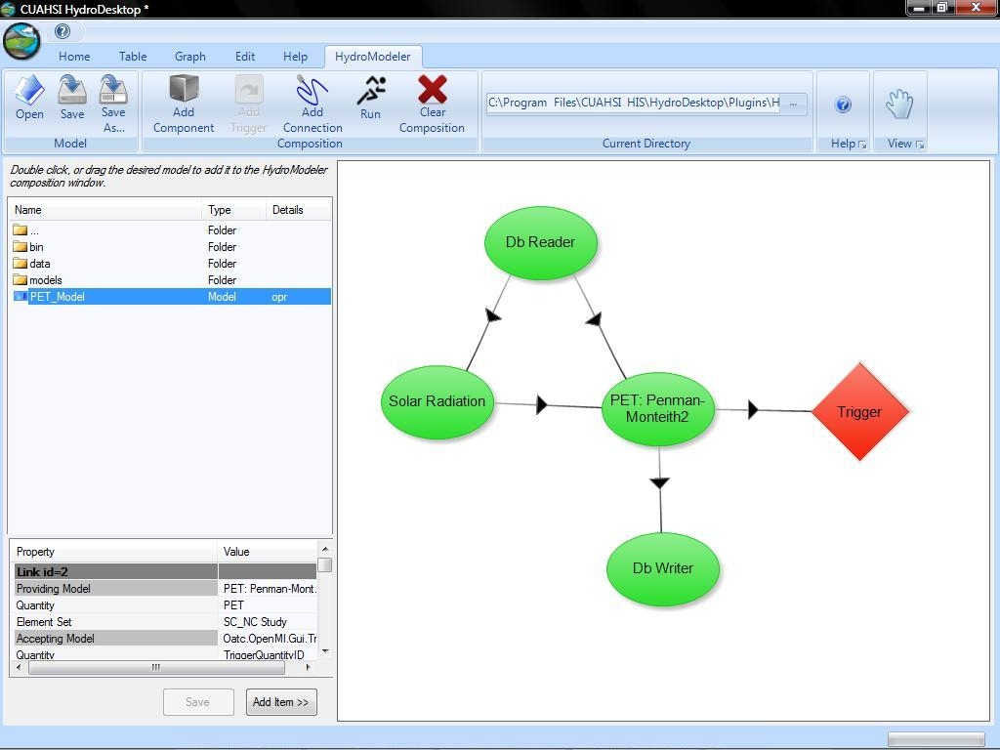
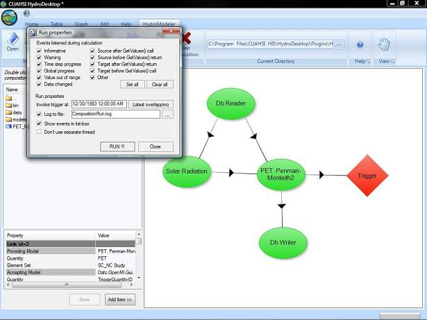
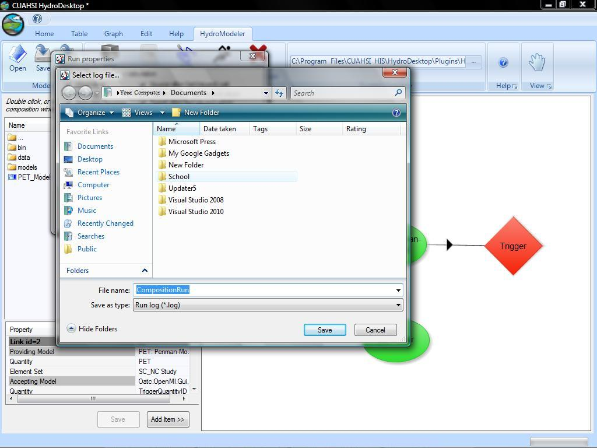
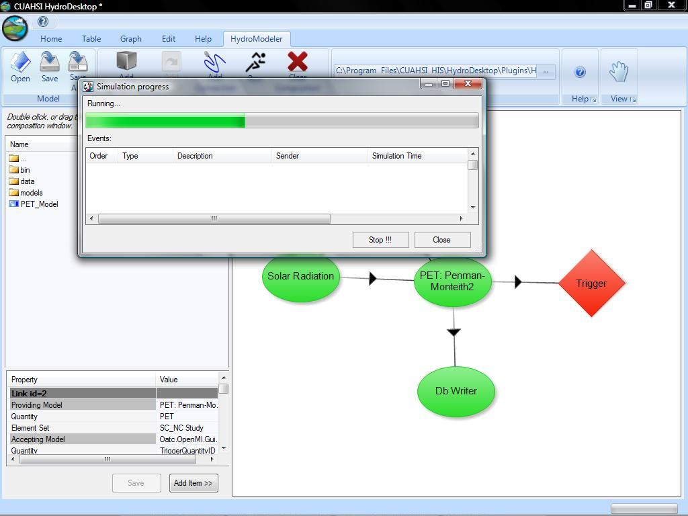
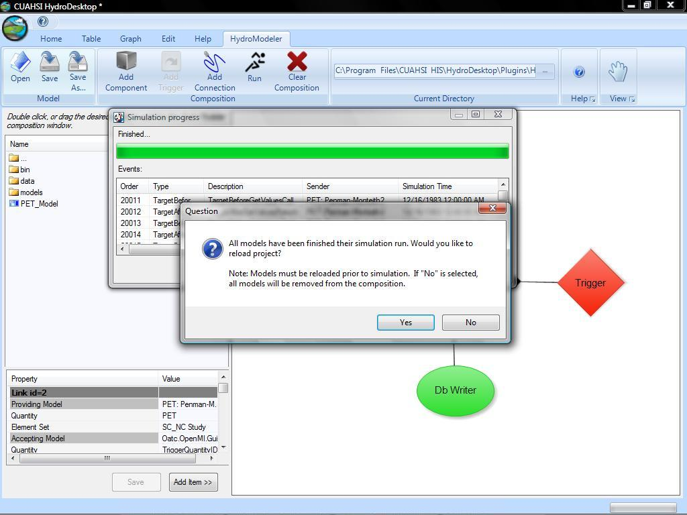

.. index:: RunningComposition

Running a Model Composition
===========================

This page will show you how to run your projects and extract the data that is calculated.

1.	Begin by loading your composition into the Hydromodeler plug in.  I will be using example configuration 2 in my images.

2.	Right click in the white space in the Hydrodesktop window and select run.  A dialog box will appear.

3.	This box will allow you to select a variety of options to fine tune the output that will be displayed once you run the project.

4.	If you do not wish to save the output to your computer, skip to the next step.  To log this information to a text document, you will need to click the box to the left of the log to file area of the previously mentioned box.  Now click the button to the right and a window will appear prompting you to choose a file name and location for your text document.  When you are finished here, click save to return to the Run Properties dialog box.

5.	When you finish altering the settings, click run on the Run Properties dialog box and another dialog box will appear.  This box will contain all the log information that you directed HydroModeler to collect.

6.	After HydroModeler has finished running your project, you can click close to be promted to select whether you would like to keep the exsisting project or clear it from the HydroModeler screen.

7.	If you created a log file, you can now navigate to the file and open it.  It will contain all of the output that was displayed when you ran your project.