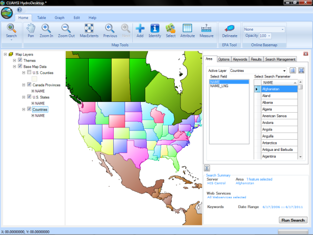
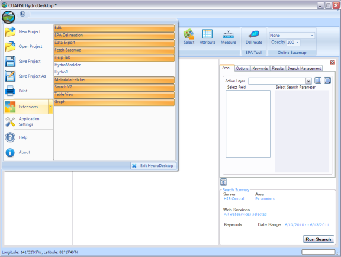
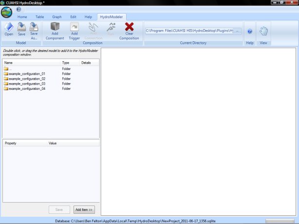
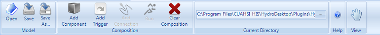
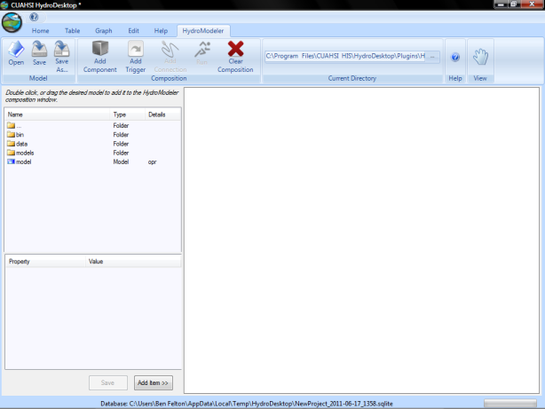
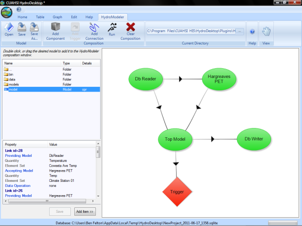

.. index:: Tutorial01

Tutorial 1: Quick Start
=======================

The quick start tutorial will familiarize you with the HydroModeler interface as we as teach you how to open a pre existing project.
   
Starting HydroModeler
---------------------

1. Begin by going to the start menu and, from program, choose the CAUHSI HIS, then press the hydrodesktop icon.  Click ok on the initial dialog box.  This is the HydroDesktop interface, which consists of the map and the map layers box.  With the map layers box, you are able to enable or disable a range of options that display simple base data (countries of the world, U.S states, major rivers and lakes, watersheds) to the map. The other parts are the Graph View and Table view menu. By default the map view does not contain any site with hydrological time series data.

.. figure:: ./images/Tutorial01/HM_fig1.png
   :align: center

2. Check that you have the latest version of hydrodesktop by comparing the version number  of the CUAHSI Hydro Desktop you have and the latest available on  http://hydrodesktop.codeplex.com/releases/view/59853 (ex; Hydro Desktop version is 1.2537.0).

3. Load the HydroModeler plugin by selecting the icon in the upper left corner of the screen - Extensions - HydroModeler.

4. A new screen will appear.  This is the HydroModeler plug in's interface.

   
HydroModeler Plugin
-------------------

1. HydroModeler is a plugin application that extends the core HydroDesktop application to support hydrologic modeling.  HydroModeler makes use of the OpenMI standard to provide a "plug and play" framework.  By adopting the OpenMI standard HydroModeler is able to focus on the specific task of running integrated modeling configurations.

2. There are a number of tools located in the ribbon that will help you organize, navigate and create your project files.

+ *Open.*  This button will allow you to open any projects you may have created or downloaded by using the windows browser to navigate to the files location.
+ *Save.*  This button will allow you to save any projects currently open in the HydroModeler interface.  If an instance of the project has already been saved and you are continuing to edit it, this button will allow you to quickly resave the file under the same name and location.
+ *Save As.*  This button will also allow you to save you projects, however, it will always create a new save for your project without overridding the original, unless you select the exact same name and location.
+ *Add Component.*  This button lets you add .omi files, also known as components, to the HydroModeler interface.  These components will be methods you can use to extract the data you need by setting up projects.
+ *Add Trigger.*  This button will finalize your project and be a terminal spot for the calculations done by your components.
+ *Add Connection.*  This button will link two components together and dictate what information is transfered between them.
+ *Run.*  This button will run your projects and output the desired data.
+ *Clear Composition.*  This button will clear all components, links and triggers present in the HydroModeler interface.
+ *Current Directory.*  This button will allow you to choose the folder that is displayed in the left hand side of the HydroModeler interface.  This folder will contain all of your components and/or project files.
+ *Help.*  This button will access the HydroDesktop help files, where you can find more information about the program as well as tutorials like the one you are reading now.
+ *View.*  This button allows you to pan through the visual depiction of your project.

   
Open an Existing Model
----------------------

A simple model configuration can be created and executed using freely available model components, provided by the HydroDesktop community.  This section describes how to utilize pre-developed model components to recreate a model simulation.  

1. At the top of the page there is an area labeled Current Directory.  By default, the current directory will already be set to the pre existing example configurations that come with the HydroModeler plug in.  In the window to the left you should see the folders within the HydroModeler example configuration folder.  Double click on example_configuration_4.  The HydroModeler window should now look like this: 

2. If none of the example configurations are present in the left hand box, look to the top of the page and find the area labeled Current Directory.  Click the button to the right of the text box and navigate to the following directory.

**Program Files/CUAHSI HIS/HydroDesktop/Plugins/HydroModeler/hydromodeler_example_configuration**
*(Note that the exact location will vary slight, based on where you installed HydroDesktop)*

3. Now double click the .opr file to add it to your HydroModeler interface.

4. The project has now loaded and you can edit or run the project as you see fit.  Continue with tutorial 2 to learn how to edit and create your own components and projects.