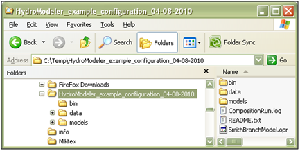
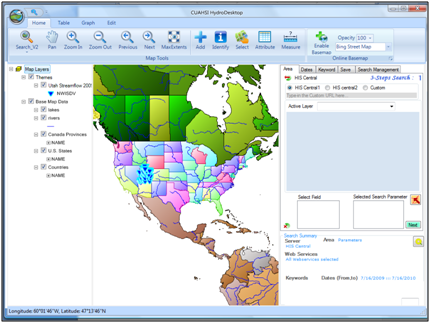
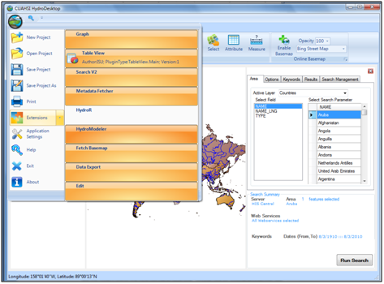
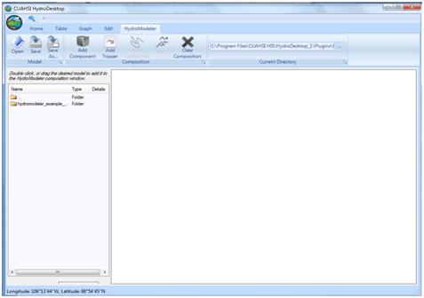
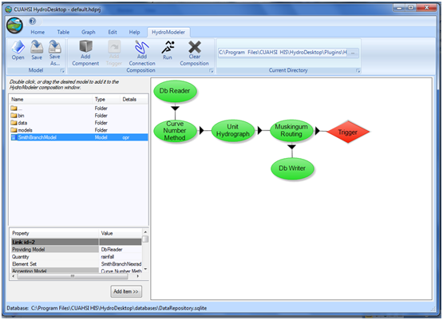
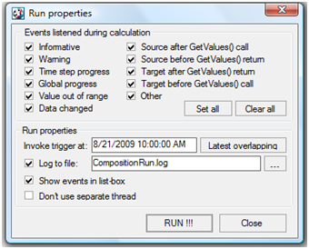
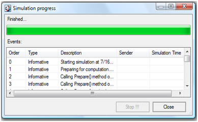

.. index:: Tutorial01

Tutorial 1: Quick Start
=======================
  
.. index:: 
   single: The HydroDesktop interface
   
The HydroDesktop interface
--------------------------

The primary part of the HydroDesktop interface is the map and the map layers box.  With the map layers box, you are able to enable or disable a range of options that display simple base data (countries of the world, U.S states, major rivers and lakes, watersheds) to the map. The other parts are the Graph View and Table view menu. By default the map view does not contain any site with hydrological time series data. These sites can be added to the map in two possible ways:

#. Search and Download Data

#. Open an existing HydroDesktop database with downloaded data. This option is explained in Appendix 2.

.. figure:: ./images/HM_figure1.png
   :align: center
   
.. index:: 
   single: HydroModeler
   
HydroModeler Plugin
-------------------

HydroModeler is a plugin application that extends the core HydroDesktop application to support hydrologic modeling.  HydroModeler makes use of the OpenMI standard to provide a "plug and play" framework.  By adopting the OpenMI standard HydroModeler is able to focus on the specific task of running integrated modeling configurations.

.. index:: 
   single: Model Simulation
   
Open an Existing Model
----------------------

A simple model configuration can be created and executed using freely available model components, provided by the HydroDesktop community.  This section describes how to utilize pre-developed model components to recreate a model simulation.  

1.	Download the latest version of HydroDesktop (available at http://www.hydrodesktop.com/), and follow the installation wizard.  

If you have downloaded the beta 1.0 release of HydroDesktop the example configurations for HydroModeler are included in the installer under Plugins - HydroModeler.  Otherwise,  you will need to download the example configurations separately.  Navigate to the Documentation tab on the HydroDesktop website.  Here you will find tutorials on various features, including "HydroModeler Example Configuration".  Download the latest version.

2.	Extract this folder into c:/Temp, so that the HydroModeler folder is located at to C:/Temp/HydroModeler_example_configuration...

In the bin directory you will find all of the libraries needed to run the model.  The "data" folder contains all of the necessary input files for each model component, and the "models" folder contains files pertaining to each individual model components.

3.	Open HydroDesktop (Start - Program Files - HydroDesktop).

4.	Load the HydroModeler plugin by selecting the icon in the upper left corner of the screen - Extensions - HydroModeler.

5.	A new page will appear:

6.	At the top of the page there is an area labeled Current Directory.  Use the toggle button to navigate to the location of the HydroModeler example that was downloaded in step 2 (c:/temp/HydroModeler_example_configuration/...).  In the window to the left you should see the folders within the HydroModeler example.  Double click on SmithBranchModel.opr.  The HydroModeler window should now look like this: 

Clicking on the arrows provides information about the data being passed across each linkage.  Everything has been pre-defined, so there is no need to edit any of the links.

7.	Execute the model by selecting the "Run" button from the top of the page.

8.	The Run Properties window will appear.  This is where simulation properties are specified, such as notifications, log file path, etc... Everything has been pre-set so all that is needed is to click RUN!

9.	During model simulation, a progress window will show you events that are occurring.  When simulation is complete, the last notification will read "Simulation Finished Successfully".  Click "Close". At the next dialog window, click "Yes" to reload the model components. 

