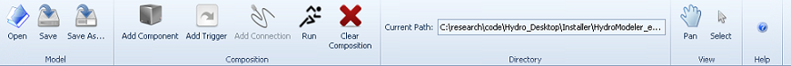
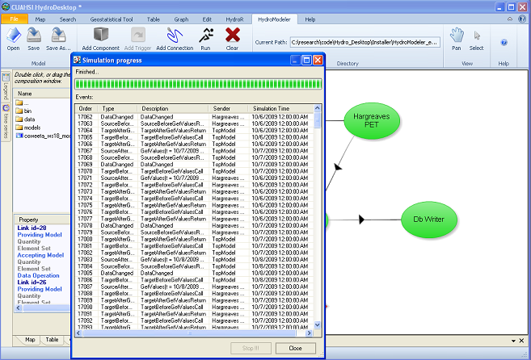
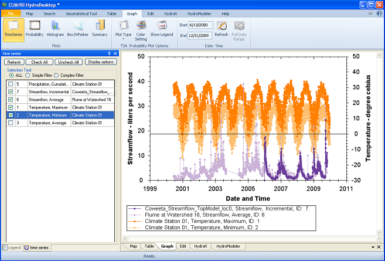

.. index:: Tutorial01

Tutorial 1: Quick Start
=======================

The quick start tutorial will familiarize you with the HydroModeler interface as we as teach you how to open a pre-existing project.
   
Starting HydroModeler
---------------------

1. Begin by going to the start menu and, from program, choose the CUAHSI HIS, then press the HydroDesktop icon.  Click ok on the initial dialog box.  

.. figure:: ./images/Tutorial01/HM_fig1_m2.png
   :align: center 
.
   
This will start HydroDesktop (shown below), which consists of the map and the map layers box.  With the map layers box, you are able to enable or disable a range of options that display simple base data (countries of the world, U.S states, major rivers and lakes, watersheds) to the map. The other parts are the Graph View and Table view menu.

.
   
2. Load the HydroModeler plugin by selecting the icon in the upper left corner of the screen - Extensions - HydroModeler.

.. figure:: ./images/Tutorial01/HM_fig3_m2.png
   :align: center
.
   
A new tab will appear in HydroDesktop.  This is the HydroModeler plug-in's user interface.

.

HydroModeler Plugin
-------------------

HydroModeler is a plugin application that extends the core HydroDesktop application to support hydrologic modeling.  HydroModeler makes use of the OpenMI standard to provide a "plug and play" framework.  By adopting the OpenMI standard HydroModeler is able to focus on the specific task of running integrated modeling configurations.

There are a number of tools located in the ribbon that will help you organize, navigate and create your project files.

.

+ *Open.*  This button will allow you to open any projects you may have created or downloaded by using the windows browser to navigate to the files location.
+ *Save.*  This button will allow you to save any projects currently open in the HydroModeler interface.  If an instance of the project has already been saved and you are continuing to edit it, this button will allow you to quickly resave the file under the same name and location.
+ *Save As.*  This button will also allow you to save you projects, however, it will always create a new save for your project without overridding the original, unless you select the exact same name and location.
+ *Add Component.*  This button lets you add .omi files, also known as components, to the HydroModeler interface.  These components will be methods you can use to extract the data you need by setting up projects.
+ *Add Trigger.*  This button will finalize your project and be a terminal spot for the calculations done by your components.
+ *Add Connection.*  This button will link two components together and dictate what information is transfered between them.
+ *Run.*  This button will run your projects and output the desired data.
+ *Clear Composition.*  This button will clear all components, links and triggers present in the HydroModeler interface.
+ *Current Directory.*  This button will allow you to choose the folder that is displayed in the left hand side of the HydroModeler interface.  This folder will contain all of your components and/or project files.
+ *Help.*  This button will access the HydroDesktop help files, where you can find more information about the program as well as tutorials like the one you are reading now.
+ *View.*  This button allows you to pan through the visual depiction of your project.

   
Open an Existing Model
----------------------

A simple model configuration can be created and executed using freely available model components, provided by the HydroDesktop community.  This section describes how to utilize pre-developed model components to recreate a model simulation.  

1. In the window to the left you should see the folders within the HydroModeler example configuration folder.   Double click on example_configuration_4.  The HydroModeler window should now look like this: 

.
   
.. NOTE::
	At the top of the page there is an area labeled Current Directory. You can change the current directory to any path on the computer using this textbox. By default, the current directory will already be set to the pre-existing example configurations that come with the HydroModeler plug in.  If none of the example configurations are present in the left hand box, look to the top of the page and find the area labeled Current Directory.  Click the button to the right of the text box and navigate to the following directory. C:/Program Files/CUAHSI HIS/HydroDesktop/Plugins/HydroModeler/hydromodeler_example_configuration. Note that the exact location will vary slight, based on where you installed HydroDesktop.
.

2. Double-click the OpenMI Pproject file (*.opr) to add it to your HydroModeler canvas.

.

3. Press the Run button from the user interface and the Run Properties box will appear.

.

4. For now, just click Run and HydroModeler will output data to your screen.

.

5. Once the simulation has finished running, you can click close and decide wether you would like to keep the open composition (by selecting Yes) or clear HydroModeler (by selecting No).  Click No.

.. figure:: ./images/Tutorial01/HM_fig10_m2.png
   :align: center

Accessing the output data
-------------------------

Now that you have run your composition, the data calculated will be stored to your computer in a specific location.

1. For this tutorial, that data can be located in *C:/Hydrodesktop/Installer/HydroModeler_example_configurations/example_configuration_04/Data/cuahsi-his*

2. Click on the Table tab located in HydroDesktop and then click Change in the Database section located in the ribbon.

.

3. From here, you can navigate to the aforementioned location and find the example4.sqlite file.  Click Open and then Ok to display your data series.  Information will appear in the left hand box.

.. figure:: ./images/Tutorial01/HM_fig12_m2.png
   :align: center
.

4.  To show greater detail on the data, check the box next to the desired data series.  Check Precipitation.

.

5.  To export this data to an external program, click Export within the Table tab.  A dialog box appears allowing you to choose what data to export, the notation used to seperate the data, and the name and location of the output file.  When you are finished, click Ok and a text file will be created in the location you chose.

.

6. This data can also be manipulated in the Graph tab to present you with a visual representation of the data series, as shown in the image below.  This is explained further in tutorial 2.

