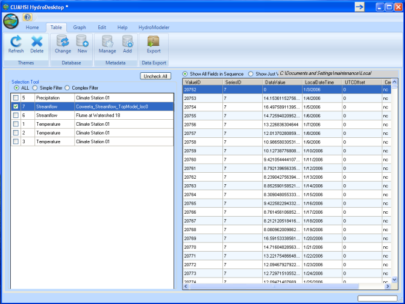
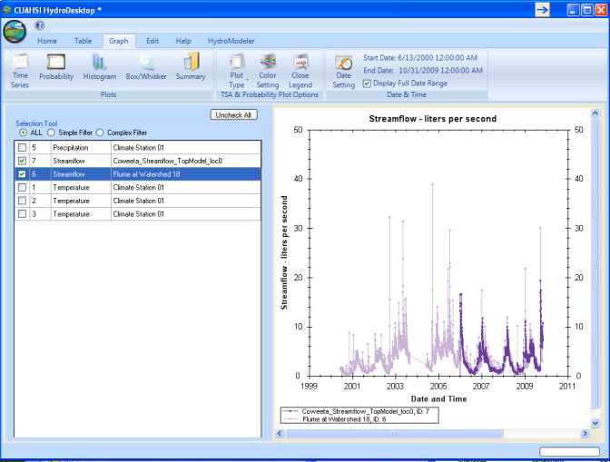
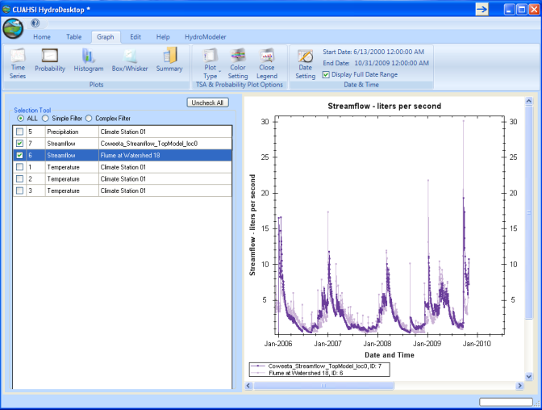
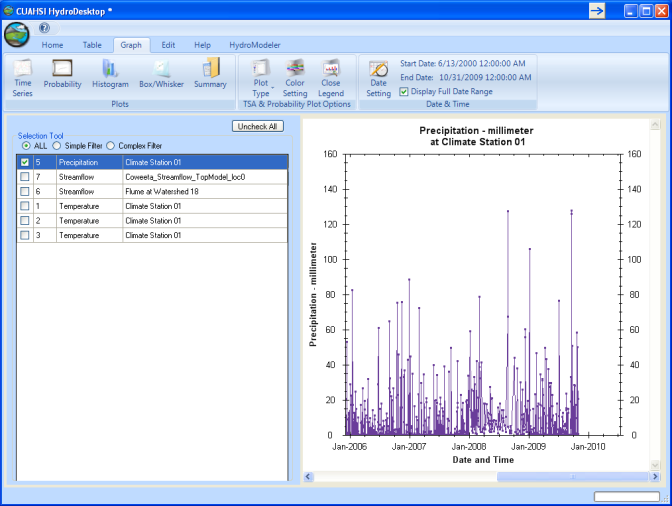

.. index:: Tutorial02

Tutorial 2: Creating and Running a Model Configuration
====================================================
The purpose of this tutorial is to show how to create a model configuration by linking components in HydroModeler, and then how to execute it and view model output.  In short, the goal of this tutorial is to create the project in example configuration 4: watershed runoff calculation using TOPMODEL. 

Overview
--------
In this exercise we are interested in calculating the streamflow at the outlet of a watershed using a TOPMODEL component coupled to a Evapotranspiration component. We will be simulating watershed number 18 in the Coweeta Hydrologic Laboratory located near Asheville, NC. The TOPMODEL component requires an ASCII raster file of Topographic index for every pixel in the watershed, model parameters (m, Tmax, R, and canopy interception), and two input exchange items (precipitation and evapotranspiration). Input precipitation was obtained using the HydroDesktop search mechanism, and stored in a local database file. Daily potential evapotranspiration rate is calculated and delivered by a Hargreaves model component. The Hargreaves component is also linked to the HydroDesktop database to obtain three input exchange items (maximum, minimum, and average daily temperatures). Finally, the TOPMODEL component is connected to a trigger which mediates the model run, and to the DbWriter component to store the output streamflow values back into the HydroDesktop database. Finally, the stored streamflow is plotted using the HydroDesktop Graph View plugin and compared to observed streamflow values.

Creating the Configuration
------------------------

1. Open the start menu, choose Program -- CUAHSI HIS -- HydroDesktop.

|

.. figure:: ./images/Tutorial02/Hydrodesktop_start.png
   :align: center
   
|

.. NOTE::
	You can check that you have the latest version of HydroDesktop by comparing the version number of the CUAHSI Hydro Desktop you have and the latest available on  http://hydrodesktop.codeplex.com. This tutorial was written using HydroDesktop version 1.2537.0. 

|
	
2. Choose Create New Empty Project button.

|  

.. figure:: ./images/Tutorial02/newproject.png
   :align: center
   
|

3.	Load the HydroModeler plugin by selecting the Orb icon in the upper left corner of the screen - Extensions - HydroModeler.

|

   
|

4.	Set the current directory, using the ribbon toolbar "Current Directory" textbox, to *C:/Hydrodesktop/Installer/HydroModeler_example_configurations/example_configuration_04/models/TOPMODEL*. 

|

.. figure:: ./images/Tutorial02/CurrentDirectory.png
   :align: center
|

5.	Click once on TopModel.omi to populate its attributes in the properties window.  Make sure that the "Assembly" and "Class" properties are correct.  Next, check that the correct paths are given for inputs "TI" and "ConfigFile". 

|

   
|

6.	Follow the same procedures to be sure that the Hargreaves, DbReader, and Dbwriter omi files are setup correctly.

|

7.	Now that all model inputs have been verified, we can begin to construct the model configuration.  To add a model, click the "Add Component" button on the ribbon toolbar.

|

.. figure:: ./images/Tutorial02/ModelAdding.png
   :align: center
   
|

8.	 Navigate to *C:/Hydrodesktop/Installer/HydroModeler_example_configurations/example_configuration_04/models* and add both models (TOPMODEL and Hargreaves),and add the DbReader and DbWriter components from *C:/Hydrodesktop/Installer/HydroModeler_example_configurations/example_configuration_04/Data/cuahsi-his*. Now all the models should be added to the HydroModeler workspace. Finally, click the "Add Trigger" button on the ribbon toolbar to add a trigger component to the configuration. 

|

.. figure:: ./images/Tutorial02/Component.png
   :align: center
   
|

9.	Connections must be added between components to define how data will flow during model simualation.  To add a connection, click the "Add Connection" button on the ribbon toolbar.  Next, click on the DbReader to assign it as the source component and then click on the Hargreaves to assign it as the target component.

|

10. Click on the link arrow to view the connection properties between the DbReader and Hargreaves components. Expand the Temperature output exchange item of the Dbreader to view the available data series. Select "Coweeta Max Temperature" as the output exchange item and "Max Temp" as the input exchange item, then press apply to activate the link. Repeat this with the "Minimum Temperature" and "Temperature" items as well.

|

.. figure:: ./images/Tutorial02/Dbconnection.png
   :align: center
|	

11.	Add a connection between the DbReader to the TOPMODEL components.  This will serve to supply input precipitation for the Coweeta watershed to the TOPMODEL component. Choose DbReader as a source and TopModel as a target component.

|

.. figure:: ./images/Tutorial02/DbTopmodel.png
   :align: center
   
|	

12.	Connect the Hargreaves PET as a source component to supply the calculated PET values to the TOPMODEL component. 	

|

.. figure:: ./images/Tutorial02/hargreaves-TopModel.png
   :align: center
   
|

13.	Create a connection between the TOPMODEL and DbWriter components.  This will used to save TOPMODEL output to the HydroDesktop database.

|

.. figure:: ./images/Tutorial02/DbWriter-TopModel.png
   :align: center
   
|

14.	Finally, create a connection between the TOPMODEL and the Trigger.

|

.. figure:: ./images/Tutorial02/TopModel-Trigger.png
   :align: center
   
|

Running the Configuration
-----------------------

|

1.	From the ribbon toolbar, select the "Run" button.

|

.. figure:: ./images/Tutorial02/run.png
   :align: center

|

2.	Turn on all simulation event notifications by selecting the "Set all" button.  Then choose a simulation end time, or click "Latest overlapping" to let HydroModeler determine the simulation end time. Finally, click "RUN!!".

|

|

3.	Simulation running.

|

.. figure:: ./images/Tutorial02/duringruning.png
   :align: center
|

4.	Simulation finish succesfully.

|

.. figure:: ./images/Tutorial02/finishsuccess.png
   :align: center
   
|

Viewing Model Output
--------------------

|

1. Switch to the Table ribbon tab.

|

.. figure:: ./images/Tutorial02/graphview.png\
   :align: center
   
|

2.	Next, we need to tell HydroDesktop to look at the database containing our simulation output.  To do this, click the "Change" database ribbon button. Navigate to *C:/Hydrodesktop/Installer/HydroModeler_example_configurations/example_configuration_04/Data/cuahsi-his* and select OK.

|

.. figure:: ./images/Tutorial02/changedb.png
   :align: center
   
|

3.	You will now see all available data series.

|
 

|

5.	Switch to the *Graph* tab to plot the results.
 
|

|

6.	Load the measured and calculated runoff data series for the Coweeta watershed, *Flume at watershed 18*.  We can now compare our calculated streamflow with known observation.

|

|

7.	To get a better view of how well our calculation matches the known observations, zoom into the simulation period by drawing a box around the data series using the mouse.

|

   
|

.. NOTE::
    After comparing the results, we can return back to the HydroModeler tab and change model parameters and then re-run the simulation to produce a better fit between calulated and observed streamflow. 

|

9.	Next, uncheck the streamflow data series and instead select precipitation to show the input precipitation data series.  This can also be done with the temperature data series.

.

10.	To utilize our calculation outside of HydroDesktop, we can export it using the "Export" ribbon button located on the Table tab. 

