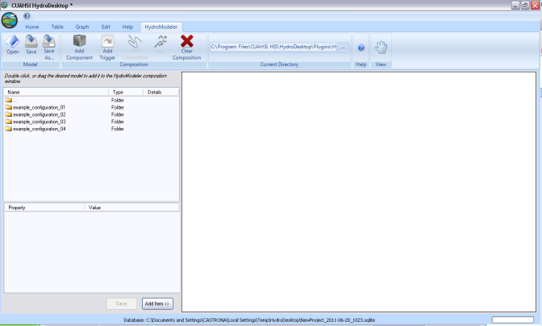

.. index:: Tutorial02

Tutorial 2: Creating and Running a Model Composition
====================================================
The purpose of this tutorial is to show how to create a project by linking ready developed components in HydroDesktop, and finally extract the data that are calculated. In this demonstration, we will create example configuration 4 (watershed runoff calculation using TopModel). 

Composite structure
-------------------
In this exercise we are interested in calculating the runoff (mm/day) using TopModel component for watershed number 18 in cowetta watershed, Asheville, NC. TopModel component needs an ascii raster of Topographic index for every pixel in the watershed, model parameter (m-To-interception), and  two input exchange items (Daily Precipitation-Daily Potential Evapotranspiration) changing with every time step. First, daily precipitation rate (mm) is obtained from the Db reader (connected to data base). Second, daily evapotranspiration rate (mm/day) is calculated and delivered by Hargreaves component. Db reader supply three input exchange items (Maximum-Minimum-Average) daily Temperature to Hargreaves component. The Db reader is connected to the stored data of watershed 18. Finally, the TopModel will be connected with a trigger to start the calculation at every time step (day), and the Db writer component to store the runoff value to data base. The stored runoff can be plotted as a time series using hydrodesktop grah.

Composite Creation
--------------

1. Open the start menu and from program choose the CAUHSI HIS, then press hydrodesktop icon.

.. figure:: ./images/Tutorial02/Hydrodesktop_start.png
   :align: center
.

2. check that you have the latest version of hydrodesktop by comparing the version number  of the CUAHSI Hydro Desktop you have and the latest available on  http://hydrodesktop.codeplex.com/releases/view/59853 (ex; Hydro Desktop version is 1.2537.0). Choose Create New Empty Project button.
  

.

3.	Load the HydroModeler plugin by selecting the icon in the upper left corner of the screen - Extensions - HydroModeler.

.. figure:: ./images/Tutorial02/extensions.png
   :align: center
.

4.	Navigate to C:/Hydrodesktop/Installer/HydroModeler_example_configurations/example_configuration_04-models/TOPMODEL. 

.

5.	Edit the Topmodel.omi and be sure that the TopModel.Linkable_Component" Assembly  is pointing relatively toward the right TopModel.dll file of the model. check the path of both the input TI_raster,configuration file.xml, and revise the values of the input model parameters.

.. figure:: ./images/Tutorial02/TopModel.omi.png
   :align: center

6.	Follow the same procedures to be sure that  the Hargreaves, Db reader, Dbwriter omi files are  pointing toward the right .dll file and DataRepository.sqlite.

7.	Right click on the HydroModeler workspace and select Add Model.

.

8.	 Navigate to C:/Hydrodesktop/Installer/HydroModeler_example_configurations/example_configuration_04/models and add all two models (TopModel-Hargreaves),and add the DbReader and DbWriter components from C:/Hydrodesktop/Installer/HydroModeler_example_configurations/example_configuration_04/Data/cuahsi-his. now all the models should be added to the HydroModeler workspace. Right click in the HydroModeler workspace and select Add Trigger. A Trigger starts the simulation by invoking the action GetValues on the model at a specified time. 

.. figure:: ./images/Tutorial02/Component.png
   :align: center
.

9.	From the top bar choose table and press change button to define the path for the SQlite database file, navigate to C:/Hydrodesktop/Installer/HydroModeler_example_configurations/example_configuration_04/Data/cuahsi-his and select weather Data repository.

.. figure:: ./images/Tutorial02/tables.png
   :align: center
.

10.	return back to the HydroModeler tab. Right click in the HydroModeler workspace and select Add Connection. Next, click on the DbReader to assign it as the source component and then click on the Hargreaves to assign as a target component.

11.	Click on the arrow mark to open a connection properties window. Define the output exchange item that will be supplied as an input exchange item.  check the (+) mark for Temperature  of the Dbreader Output Exchange Items to show the three exchanging Temperature items,  check Coweeta max Temperature box and Hargreaves PET Max Temp box, and then press apply to activate the link. Repeat for all links. 

.. figure:: ./images/Tutorial02/Dbconnection.png
   :align: center
.	

12.	Connect the Dbreader to the TopModel to supply the TopModel with the precipitation data of Coweeta watershed. choose Dbreader as a source and TopModel as a target component. 

.	

13.	Connect the Hargreaves PET as a source component to supply the daily calculated PET  to TopModel component. 	

.. figure:: ./images/Tutorial02/hargreaves-TopModel.png
   :align: center
.

14.	Link the TopModel Component as a source to the Db Writer to store the output data (daily runoff hydrograph).

.. figure:: ./images/Tutorial02/DbWriter-TopModel.png
   :align: center
.

15.	Link the TopModel as a source component to the trigger.

.

16.	Right click in the HydroModeler workspace and select Run.	

.. figure:: ./images/Tutorial02/run.png
   :align: center
.

17.	Select Set all within Events listened during calculation, click Latest overlapping to determine the simulation end time, and finally click RUN!!.

.. figure:: ./images/Tutorial02/runsetup.png
   :align: center
.