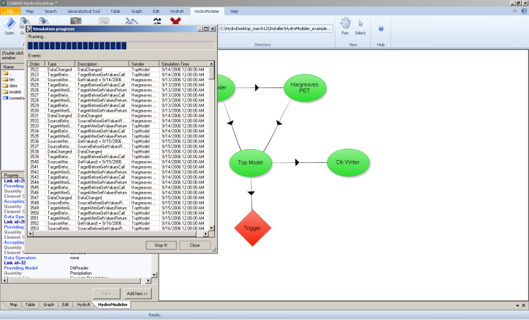
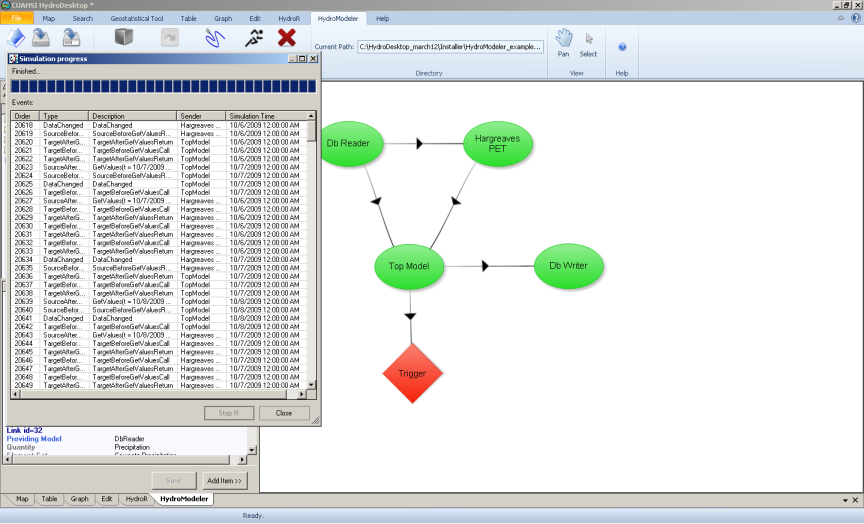

.. index:: Tutorial02

Tutorial 2: Creating and Running a Model Configuration
====================================================
The purpose of this tutorial is to show how to create a project by linking  components in HydroDesktop and how to execute and view model output through the HydroDesktop user interface.  In short, the goal of this tutorial is to create the project in example configuration 4 (watershed runoff calculation using TOPMODEL). 

Overview
--------
In this exercise we are interested in calculating the streamflow at the outlet of a watershed using a TOPMODEL component coupled to a Evapotranspiration component.  We will be simulating watershed number 18 in the Coweeta Hydrologic Laboratory located near Asheville, NC. The TOPMODEL component requires an ASCII raster file of Topographic index for every pixel in the watershed, model parameters (m, To, and canopy interception), and two input exchange items (precipitation and evapotranspiration).  In this example, we will obtain daily precipitation from a HydroDesktop database file.  These files were downloaded earlier from the HIS web services.  Daily potential evapotranspiration rate will be calculated and delivered by a Hargreaves model component. This Hargreaves component will be linked to the HydroDesktop database which will supply three input exchange items (maximum, minimum, and average daily temperature). Finally, the TOPMODEL component will be connected to a trigger to initiate the model run, and to the  DbWriter component to store the streamflow values to the HydroDesktop database. Finally, the stored streamflow can be plotted as a time series using the HydroDesktop Graph View tab and compared to observed streamflow values.

Creating the Configuration
------------------------

1. Open the start menu, choose Program -- CUAHSI HIS -- HydroDesktop.

.

.. NOTE::
	You can check that you have the latest version of HydroDesktop by comparing the version number of the CUAHSI Hydro Desktop you have and the latest available on  http://hydrodesktop.codeplex.com. This tutorial was written using HydroDesktop version 1.2537.0. 
	
2. Choose Create New Empty Project button.
  
.. figure:: ./images/Tutorial02/newproject.png
   :align: center
.

3.	Load the HydroModeler plugin by selecting the Orb icon in the upper left corner of the screen - Extensions - HydroModeler.

.. figure:: ./images/Tutorial02/extensions.png
   :align: center
.

4.	Set the current directory to *C:/Hydrodesktop/Installer/HydroModeler_example_configurations/example_configuration_04/models/TOPMODEL*. 

.. figure:: ./images/Tutorial02/CurrentDirectory.png
   :align: center
.

5.	Edit the Topmodel.omi and be sure that the TopModel.Linkable_Component" Assembly  is pointing to the TopModel.dll file. Check the path of both the input TI_raster and config.xml files, and revise the values of the input model parameters if necessary.

.. figure:: ./images/Tutorial02/TopModel.omi.png
   :align: center

6.	Follow the same procedures to be sure that the Hargreaves, DbReader, and Dbwriter omi files are setup correctly.

7.	Right click on the HydroModeler workspace and select Add Model.

.. figure:: ./images/Tutorial02/ModelAdding.png
   :align: center
.

8.	 Navigate to *C:/Hydrodesktop/Installer/HydroModeler_example_configurations/example_configuration_04/models* and add both models (TOPMODEL and Hargreaves),and add the DbReader and DbWriter components from *C:/Hydrodesktop/Installer/HydroModeler_example_configurations/example_configuration_04/Data/cuahsi-his*. Now all the models should be added to the HydroModeler workspace. Right-click in the HydroModeler workspace and select Add Trigger. A Trigger starts the simulation by invoking the component communication for each time step. 

.. figure:: ./images/Tutorial02/Component.png
   :align: center
.

9.	From the top bar choose table and the press change button to define the path for the SQlite database file. Navigate to *C:/Hydrodesktop/Installer/HydroModeler_example_configurations/example_configuration_04/Data/cuahsi-his* and select the data repository.

.

10.	Return back to the HydroModeler tab. Right-click in the HydroModeler workspace and select Add Connection. Next, click on the DbReader to assign it as the source component and then click on the Hargreaves to assign it as the target component.

11.	Click on the arrow mark to open a connection properties window. Click the (+) mark for Temperature  of the Dbreader Output Exchange Items to show the three exchange items.  Check Coweeta max Temperature box and Hargreaves PET Max Temp box, and then press apply to activate the link. Repeat to link the Min Temp exchange items as well. 

.	

12.	Connect the DbReader to the TOPMODEL component to supply the TOPMODEL with the precipitation data for the Coweeta watershed. Choose DbReader as a source and TOPMODEL as a target component. 

.. figure:: ./images/Tutorial02/DbTopmodel.png
   :align: center
.	

13.	Connect the Hargreaves PET as a source component to supply the calculated PET values to the TOPMODEL component. 	

.

14.	Link the TOPMODEL Component as a source to the DbWriter to store the output data (streamflow).

.

15.	Link the TOPMODEL as a source component to the trigger.

.. figure:: ./images/Tutorial02/TopModel-Trigger.png
   :align: center
.

Running the Configuration
-----------------------

16.	Right click in the HydroModeler workspace and select Run.	

.

17.	Select Set all within Events listened during calculation, click Latest overlapping to determine the simulation end time, and finally click RUN!!.

.. figure:: ./images/Tutorial02/runsetup.png
   :align: center
.

18.	Simulation running.

.

19.	Simulation finish succesfully.

.

20. Go for the table tab.
