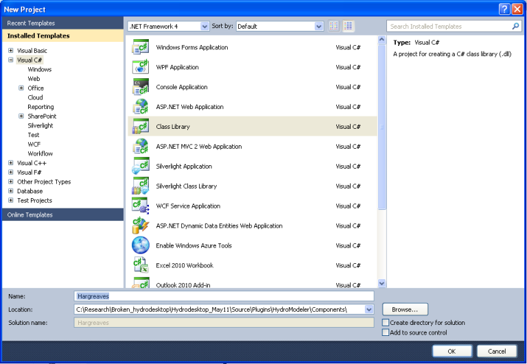
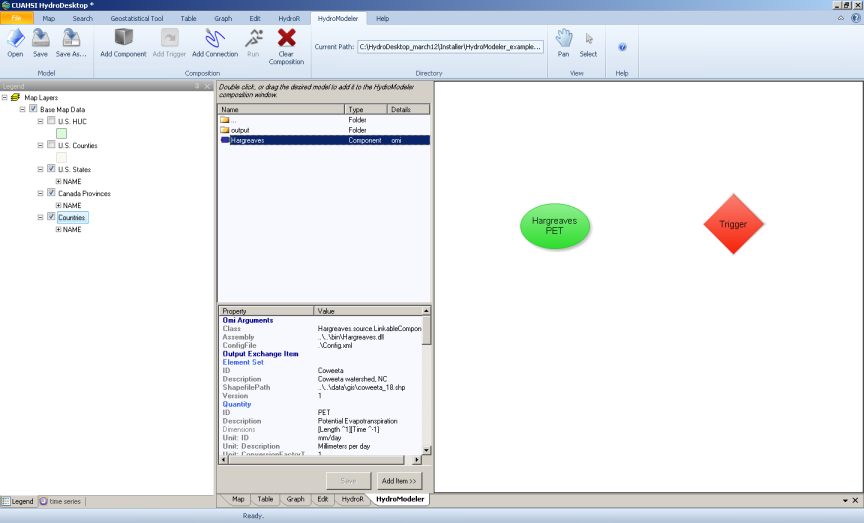

.. index:: Tutorial03

Tutorial 3: Creating a New Model Component
==========================================
   
The purpose of this tutorial is to show how to create a new component for HydroModeler using the Simple Model Wrapper (SMW) approach. The focus will be on creating the Hargreaves component that is used in Tutorial 2 to calculate potential evapotranspiration.  We will be using the C# programming language in this demonstration. Hargreaves is a simple potential evapotranspiration model that requires only geographic location and air temperature (daily minimum, maximum, and average) as input. 

.. Note:
	We assume that you have some knowledge of programming using C#.  For background information on programming with C#, we recommend Microsoft's Development Network: http://msdn.microsoft.com/en-us/beginner/bb308734.aspx.

|

.. Note:
	In this tutorial, we show how to create the component from scratch.  There is, however, a sample component template is available in the HydroDesktop source code that may be useful if you are creating your own components.  The sample component is available at *[Path to HydroDesktop Source]\Source\Plugins\HydroModeler\Components\SampleComponent*.  

|

Installing Visual Studio 
------------------------

.. Note:
	Perform these steps only if you do not already have Microsoft Visual Studio 2010 installed on your computer.
	
1. Download Microsoft Visual C# 2010 for free from http://www.microsoft.com/express/Downloads/

2. Choose the tab Visual Studio 2010 Express.  Then select Visual C# 2010 Express Edition.  Click Download and follow instructions to install.

|

Downloading HydroDesktop Source Code
------------------------------------

1. You can download the HydroDesktop source code either using the source control management system (Hg) or by going to *http://hydrodesktop.codeplex.com/SourceControl/list/changesets* and downloading the latest revision of the source control.  

Create Hargreaves component using Microsoft Visual C#
----------------------------------------------------- 

1. Start Microsoft Visual Studio 2010.

2. Create a new C# class library project.  Name the project "Hargreaves" and save it in your working directory. 

|

3. Add two new folders (source and data) by right clicking on the project name and selecting Add --> New Folder.  Next, copy the default class "class1.cs" into the source folder and rename it Hargreaves.cs. 

.. figure:: ./images/Tutorial03/folders.png
   :align: center

|

Adding References
'''''''''''''''''

1. You can view the references that currently exist in the project by expanding the "Reference" item listed in the Solution Explorer window (located on the upper right side of the page).  Currently, this project only contains the default references.  We need to add several additional references. To do this, right click on  "References" in the Solution Explorer and select "Add New Reference". 

.. figure:: ./images/Tutorial03/ref.png
   :align: center

|

2. Browse to *[Path to HydroDesktop Source Code]/Binaries/Plugins/HydroModeler/*. Add the following dll's:
  - Oatc.OpenMI.Sdk.Backbone.dll 
  - Oatc.OpenMI.Sdk.Buffer.dll 
  - Oatc.OpenMI.Sdk.DevelopmentSupport.dll 
  - Oatc.OpenMI.Sdk.Wrapper.dll 
  - OpenMI.Standard.dll)

3. Right click on "References" in the solution explorer again and browse to *[Path to HydroDesktop]/Binaries/Plugins/HydroModeler/example_configuration/bin*.  Add the following dll:
   - SMW.dll.

.. figure:: ./images/Tutorial03/referencesstructure.png
   :align: center

|

Create the Linkable Component Class
'''''''''''''''''''''''''''''''''''

1. Right-click on the "source" folder in the Solution Explorer and select Add --> Class. Rename the class LinkableComponent.cs. 

.. figure:: ./images/Tutorial03/linkablecomponent.png
   :align: center

|

2. Add the following line of code so that the LinkableComponent class inherits from the Oatc.OpenMI.Sdk.Wrapper.LinkableEngine abstract class.

.. code-block:: c#
	class SampleLinkableComponent : Oatc.OpenMI.Sdk.Wrapper.LinkableEngine

|

Creating the Hargreaves Component using SMW
'''''''''''''''''''''''''''''''''''''''''''

1. Include the following using statements to the top of the Hargreaves.cs file.  

.. code-block:: c#

      using Oatc.OpenMI.Sdk.Backbone;
      using Oatc.OpenMI.Sdk.Buffer;
      using Oatc.OpenMI.Sdk.DevelopmentSupport;
      using Oatc.OpenMI.Sdk.Wrapper;
      using SMW;

|

2. Make the class inherit from SMW.Wrapper.

.. code-block:: c#
	
        public class Engine : SMW.Wrapper
        
		
3. Define the global variables for the class using the following lines of code. 

.. code-block:: c#
	
        namespace Hargreaves
        {
			public class Engine : SMW.Wrapper
			{
				public string[] input_quantity;
				public string output_quantity;
				public string[] input_elementset;
				public string output_elementset;
				Dictionary<DateTime, double[]> _output = new Dictionary<DateTime, double[]>();
				string output_path = "./hargreaves_output.txt";

|

4. Define what the component should do when a model is loaded into HydroModeler by implementing the *Initialize* method.  In the code below, the component will read input data from the configuration file and create input and output exchange items from the information included in the configuration file.

.. code-block:: c#
 
        public override void Initialize(System.Collections.Hashtable properties)
        {
            //---- get configuration data
            string config = null;
            if (properties.ContainsKey("ConfigFile"))
                config = properties["ConfigFile"].ToString();
            else
                throw new Exception("A configuration file must be supplied for the Hargreaves component!!!");

            if (properties.ContainsKey("Output"))
                output_path = properties["Output"].ToString();

            //---- set smw parameters
            this.SetVariablesFromConfigFile(config);
            this.SetValuesTableFields();

            //---- get exchange item attributes
            //-- input exchange items
            int num_inputs = this.GetInputExchangeItemCount();
            input_elementset = new string[num_inputs];
            input_quantity = new string[num_inputs];
            for(int i=0; i<= num_inputs-1; i++)
            {
                InputExchangeItem input = this.GetInputExchangeItem(i);
                input_elementset[i] = input.ElementSet.ID;
                input_quantity[i] = input.Quantity.ID;
            }

            //-- output exchange items
            int num_outputs = this.GetOutputExchangeItemCount();
            OutputExchangeItem output = this.GetOutputExchangeItem(num_outputs - 1);
            output_elementset = output.ElementSet.ID;
            output_quantity = output.Quantity.ID;
        }

|

5. Define what the component should do when a model is for each iteration of the model run by implementing the *PerformTimeStep* method.  In the code below, the component will get input data from other components and then using the data to calculate PET for that time step.  Finally, it will set the PET values for other components to read.  

.. code-block:: c#

	public override bool PerformTimeStep()
        {
            //---- get input data
            //-- temp
            double[] temp = ((ScalarSet)this.GetValues(input_quantity[0], input_elementset[0])).data;
            //-- max temp
            double[] maxtemp = ((ScalarSet)this.GetValues(input_quantity[1], input_elementset[1])).data;
            //-- min temp
            double[] mintemp = ((ScalarSet)this.GetValues(input_quantity[2], input_elementset[2])).data;

            //---- calculate PET for each element
            //-- get the number of elements (assuming that they're all the same)
            int elemcount = this.GetInputExchangeItem(0).ElementSet.ElementCount;
            double[] pet = new double[elemcount];
            for (int i = 0; i <= elemcount - 1; i++)
            {
                pet[i] = CalculatePET(temp[i], mintemp[i], maxtemp[i], i);
            }

            //---- save output values
            DateTime dt = CalendarConverter.ModifiedJulian2Gregorian(((TimeStamp)this.GetCurrentTime()).ModifiedJulianDay);
            _output.Add(dt, pet);

            //---- set output values
            this.SetValues(output_quantity, output_elementset, new ScalarSet(pet));

            //---- advance the component's internal time
            this.AdvanceTime();

            return true;
        }

|

6.	In the PerformTimeStep method we called a second method named *CalculatePET*.  We next need to implement this method which will do the actual Hargreaves calculation.  

.. code-block:: c#

        /// 

        /// Calculates the potential evapotranspiration using the Hargreaves-Samani method
        /// 

        /// <param name="T">Averaged daily temperature</param>
        /// <param name="Tmin">Minimum daily temperature</param>
        /// <param name="Tmax">Maximum daily temperature</param>
        /// <param name="e">element index</param>
        /// <returns>PET in mm/day</returns>
        public double CalculatePET(double T, double Tmin, double Tmax, int eid)
        {

            //---- calculate the relative distance between the earth and sun
            //-- get Julian day
            TimeStamp ts = (TimeStamp)this.GetCurrentTime();
            DateTime dt = CalendarConverter.ModifiedJulian2Gregorian(ts.ModifiedJulianDay);
            int j = dt.DayOfYear;
            double dr = 1 + 0.033 * Math.Cos((2 * Math.PI * j) / 365);

            //---- calculate the solar declination
            double d = 0.4093 * Math.Sin((2 * Math.PI * j) / 365 - 1.405);

            //---- calculate the sunset hour angle
            //-- get latitude in degrees
            ElementSet es = (ElementSet)this.GetInputExchangeItem(0).ElementSet;
            Element e = es.GetElement(eid);
            double p = e.GetVertex(0).y * Math.PI / 180;
            //-- calc ws
            double ws = Math.Acos(-1 * Math.Tan(p) * Math.Tan(d));

            //---- calculate the total incoming extra terrestrial solar radiation 
            double Ra = 15.392 * dr * (ws * Math.Sin(p) * Math.Sin(d) + Math.Cos(p) * Math.Cos(d) * Math.Sin(ws));

            //---- calculate PET (From Hargreaves and Samani 1985)
            //-- calculate latent heat of vaporization (from Water Resources Engineering, David A. Chin)
            double L = 2.501 - 0.002361 * T;
            double PET = (0.0023 * Ra * Math.Sqrt(Tmax - Tmin) * (T + 17.8)) / L;

            return PET;
            
        }

7. Define what the component should do after a model run has completed by implementing the *Finish* method.   In the code below, the component will simply write out the results to a text file.

.. code-block:: c#

    public override void Finish()
    {
		StreamWriter sw = new StreamWriter(output_path,false);
		
		//write header line
		sw.WriteLine("Simulation Time, PET[mm/day]");
		
		//write all values
		foreach (KeyValuePair<DateTime, double[]> kvp in _output)
		{
			sw.Write(String.Format("{0:MM/dd/yyyy: hh:mm tt}", kvp.Key));
			for (int i = 0; i <= kvp.Value.Length - 1; i++)
			{
				sw.Write("," + kvp.Value[i]);
			}
			sw.Write("\n");
		}

	//close file
	sw.Close();
	}

|

Compiling
''''''''''

The next step involves compiling the application.  Compiling is the process of converting written code into an binary file that the computer can run.  

1.  In Visual Studio C#, select Build --> Build Solution.  If there are any errors, the Error List window at the bottom of the screen will notify you.
   

Create the Configuration XML File
'''''''''''''''''''''''''''''''''

The configuration file defines the input and output exchange items of the component, the time horizon of the component (start and end times), as well as the time step of the component.   

1. Right-click on the Data folder in the Solution Explorer and select Add --> New Item.  Select to add an XML file.  Rename this file config.xml.

2. Add the following lines to the config.xml file to provide the overall structure. 

.. code-block:: XML
	<Configuration>
	  <ExchangeItems> </ExchangeItems>
	  <TimeHorizon> </TimeHorizon>
	  <ModelInfo> </ModelInfo>
	</Configuration>

3. Add the following output exchange item within the ExchangeItems element.  

.. code-block:: XML
	<OutputExchangeItem>
      <ElementSet>
        <ID>Coweeta</ID>
        <Description>Coweeta watershed, NC</Description>
        <ShapefilePath>..\..\data\gis\coweeta_18.shp</ShapefilePath>
        <Version>1</Version>
      </ElementSet>
      <Quantity>
        <ID>PET</ID>
        <Description>Potential Evapotranspiration</Description>
        <Dimensions>
          <Dimension>
            <Base>Length</Base>
            <Power>1</Power>
          </Dimension>
          <Dimension>
            <Base>Time</Base>
            <Power>-1</Power>
          </Dimension>
        </Dimensions>
        <Unit>
          <ID>mm/day</ID>
          <Description>Millimeters per day</Description>
          <ConversionFactorToSI>1</ConversionFactorToSI>
          <OffSetToSI>0</OffSetToSI>
        </Unit>
        <ValueType>Scalar</ValueType>
      </Quantity>
    </OutputExchangeItem>
    
|

4. Add the following input exchange item for average temperature as well. 

.. code-block:: XML

	<InputExchangeItem>
      <ElementSet>
        <ID>Climate Station 01</ID>
        <Description>Climate Station 01, near Coweeta watershed 18 in NC</Description>
        <ShapefilePath>..\..\data\gis\climateStation.shp</ShapefilePath>
        <Version>1</Version>
      </ElementSet>
      <Quantity>
        <ID>Temp</ID>
        <Description>Daily Averaged Temperature</Description>
        <Dimensions>
          <Dimension>
            <Base>Temperature</Base>
            <Power>1</Power>
          </Dimension>
        </Dimensions>
        <Unit>
          <ID>Celsius</ID>
          <Description>Degrees Celsius</Description>
          <ConversionFactorToSI>1</ConversionFactorToSI>
          <OffSetToSI>0</OffSetToSI>
        </Unit>
        <ValueType>Scalar</ValueType>
      </Quantity>
    </InputExchangeItem>

|

5. Next add two more input exchange items for minimum and maximum temperature.  You can copy the input exchange item above and just replace the Quantity ID and Description for each of the new exchange item. 

Create the omi File
'''''''''''''''''''

The *omi* file defines the component properties including the path (which is recommended to be a relative path) to the component dll, the path to the component cofig.xml file, and any other arguments for the component.  

1. Add a new XML file under the *Data* folder as you did previously and name it Hargreaves.omi.

3. Define the relative path to the Hargeaves.dll.

4. Define an argument (Key - ReadOnly - Value) for the configuration file. Key is a string used to search in the properties of the omi, ReadOnly is a boolen and is set to be true, and Value points to the *relative* location of the configuration.xml.

5. Add an argument named Output to define the relative location of the output csv file.

.. code-block:: XML

    <LinkableComponent Type="Hargreaves.source.LinkableComponent" Assembly="..\bin\Debug\Hargreaves.dll">
	  <Arguments>
        <Argument Key="ConfigFile" ReadOnly="true" Value=".\Config.xml" />
      </Arguments>
	</LinkableComponent>

|

.. Note ::
	You may need to edit the paths to either the Hargreaves.dll or Config.xml files. They should be relative paths from the Hargreaves.omi file.
    
|

Viewing the Component in HydroModeler
'''''''''''''''''''''''''''''''''''''

You have completed the steps to create the component.  Next we will show how to load the component into HydroModeler.  

1. Start HydroDesktop.

2. Add the HydroModeler extension by selecting the orb button --> Extensions --> HydroModeler.

.. figure:: ./images/Tutorial03/HM_fig50.png
   :align: center

|

3. Use the Add Component button from the HydroModeler ribbon control to add the Hargreaves.omi file.  If everything worked correctly, you will see the Hargreaves component added to modeling canvas.  

Creating a Unit Test Case
'''''''''''''''''''''''''

The last step is to create a unit test for your new component.  A unit test allows you to verify that the component works properly.  We will show how to create tests for each of the Initialize and PerformTimeStep methods.  You could also add a test for the Finish method using the same basic approach.  There is not need to test the CalculatePET method because this is done already within the PerformTimeStep test. 

.. Note ::

	We recommend using TestDriven.Net from  http://www.testdriven.net as a user friendly way of running the unit tests. 

1. In the same solution in which you created the Hargreaves component, right-click on the solution and select Add --> New Project to create a new project for the unit tests.  Choose Visual C# Class Library and name the project HargreavesTest.  

2. Add a references to the HargreavesTest project for the following dlls.

	- nunit.framework.dll from *[Path to HydroDesktop Source]/Binaries/Plugins/HydroModeler/example_configuration/bin*
	- Oatc.OpenMI.Sdk.Backbone
	- Oatc.OpenMI.Sdk.Buffer
	- Oatc.OpenMI.Sdk.DevelopmentSupport
	- Oatc.OpenMI.Sdk.Wrapper
	- SMW

3.  Add a project reference to the Hargreaves project by right-clicking on References and selecting Add Reference and switching to the Projects tab.  

4. The following lines of code are needed to setup the test class file.  

.. code-block:: c#
       
	namespace Test
	{
		[TestFixture]
		public class TestClass
		{
			Hargreaves.Engine hargreaves;

5. To test the Initialize method, we will try to initialize the component using the config.xml file as shown in the lines below.  You may need to change the path to the config.xml file from what is shown below.

.. code-block:: c#
		
        [TestFixtureSetUp]
        public void Initialize()
        {
            //---- create instance of the hargreaves model
            hargreaves = new Hargreaves.Engine();

            //---- define input arguments
            System.Collections.Hashtable args = new System.Collections.Hashtable();
            args.Add("ConfigFile", "../../../data/config.xml");

            //---- call the initialize method
            hargreaves.Initialize(args);

            Debug.WriteLine("Initialize has completed successfully");

        }

6. To test the PerformTimeStep method, we will do an example calculation for a known solution where the average temperature is 19 degrees C, the minimum temperature is 17 degrees C, and the maximum temperature is 21 degrees C.  We know that the solution for this problem is 1.16 mm/d.  If the code does not perform this calculation correctly, the test will fail.

.. code-block:: c#
        
        [Test]
        public void PerformTimeStep()
        {
            Debug.WriteLine("\n\n---------------------------------------------------");
            Debug.WriteLine("Running the 'PerformTimeStep' Test");
            Debug.WriteLine("---------------------------------------------------");

            //---- put data into IValueSets
            IValueSet temp = new ScalarSet(new double[1] { 19 });
            IValueSet mintemp = new ScalarSet(new double[1] { 17 });
            IValueSet maxtemp = new ScalarSet(new double[1] { 21 });

            //---- set values
            hargreaves.SetValues("Temp", "Climate Station 01",temp);
            hargreaves.SetValues("Min Temp", "Climate Station 01", mintemp);
            hargreaves.SetValues("Max Temp", "Climate Station 01", maxtemp);

            //---- call perform time step
            hargreaves.PerformTimeStep();

            //---- read calculated results
            double[] pet = ((ScalarSet)hargreaves.GetValues("PET", "Coweeta")).data;

            double chk = Math.Round(pet[0], 2);
            Assert.IsTrue(chk == 1.16, "The calculated value of " + chk.ToString() + " does not equal the known value of 1.16");
        }

