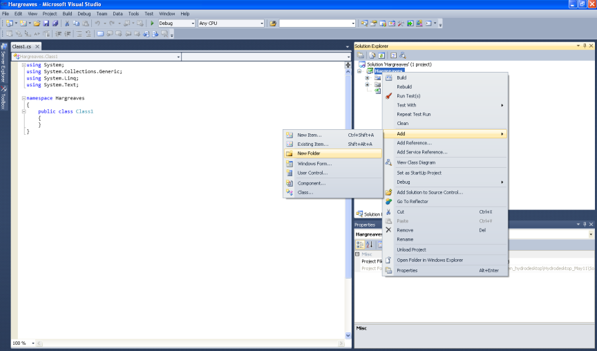
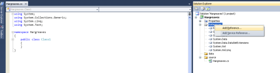
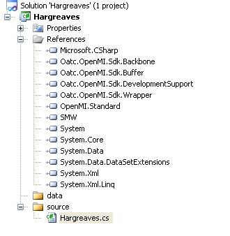
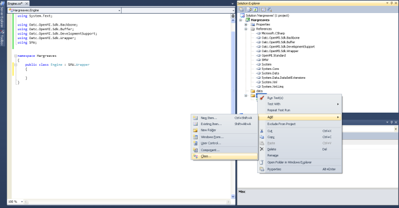
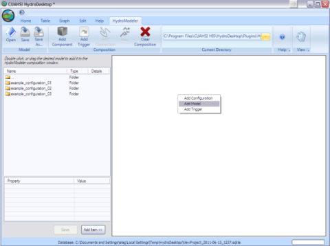

.. index:: Tutorial03

Tutorial 3: Creating a New Model Component
==========================================
   
The purpose of this tutorial is to show how to create a new component for HydroModeler using the Simple Model Wrapper (SMW) approach. The focus will be on creating the Hargreaves component that is used in Tutorial 2.  We will use C#.Net in this demonstration. C# is an object oriented programming language designed for building a wide variety of applications that run on the .NET Framework.  W

Hargreaves Component Structure
------------------------------
Hargreaves is a simple potential evapotranspiration model that requires only temperature and solar energy. The total incoming extra terrestrial solar radiation is calculated as a function in julien day. The Hargreaves component requires three input exchange items  (Maximum - Minimum - Average) daily Temperature, and gives an output exchange item (Daily Evapotranspiration) 

Getting stared with Visual C#
------------------------------

1. If you do not have access to Microsoft Visual Studio you can download Microsoft Visual C# 2010 for free from http://www.microsoft.com/express/Downloads/

2. Choose the tab Visual Studio 2010 Express.  Then select Visual C# 2010 Express Edition.  Click Download and follow instructions to install.

.. figure:: ./images/Tutorial03/HM_fig44.png
   :align: center

   
3. If you are learning C# or need a refresher there are many tutorials available on-line that can help.  The address below will take you to Microsoft's Development Network were they have a beginners learning center.  There are several links available here for learning Visual Studio C# and Visual Studio Basic: http://msdn.microsoft.com/en-us/beginner/bb308734.aspx

.. index:: 
   single: Sample Component
   
Sample Component
----------------

The sample component we will start from is a shell of how code should be written to run in HydroDesktop.  This component can be used as a guide to create and run more meaningful hydrological applications.    

1. Download the latest version of HydroDesktop source code from http://hydrodesktop.codeplex.com/SourceControl/list/changesets.

.. figure:: ./images/Tutorial03/Download.png
   :align: center
.

2. The sample component is available on the HydroDesktop website (http://hydrodesktop.codeplex.com/SourceControl/changeset/view/320c9bb87767#) and in the downloaded version.

.

.. index:: 
   single: Create Hargreaves component using Microsoft Visual C#

Create Hargreaves component using Microsoft Visual C#.
---------------------------------------------- 

1. Open the start menu-Microsoft Visual Studio- Microsoft Visual Studio.

.

2.Open the Visual Studio C# and create a new project. Choose Visual C#, Class Library, and name the project as Hargreaves. Browse to the location tab path and point hto this path *C:/Hydrodesktop_May11/Source/Plugins/HydroModeler/Components*.

.. figure:: ./images/Tutorial03/class.png
   :align: center
.

3. Add two folders (source and data), copy class1.cs into the source folder and rename it it Hargreaves.cs 

Adding References
'''''''''''''''''

A reference to a library is required to run the code you have written.  Usually a reference identifies a dll (Dynamic Linking Library) file.  The references can be viewed by expanding the Reference option listed in the Solution Explorer window located on the upper right side of the page.  

1. Right click on Reference and select Add Reference.

.

2. A window will pop up. Using the tabs, browse to *C:/Hydrodesktop/Binaries/Plugins/HydroModeler*, and add (Oatc.OpenMI.Sdk.Backbone.dll - Oatc.OpenMI.Sdk.Buffer.dll - Oatc.OpenMI.Sdk.DevelopmentSupport.dll - Oatc.OpenMI.Sdk.Wrapper.dll - OpenMI.Standard.dll)

3. Navigate to *C:/Hydrodesktop/Binaries/Plugins/HydroModeler/example_configuration/bin* and add SMW.dll.

.

.. index:: 
   single: Namespaces
   

Namespaces
'''''''''''

Namespaces provide you a way to organize your code.  The "using" directive can be implemented as a way of accessing members of a namespace without having to type out their full name each time they are used.  When a new project is created, several common namespaces are inserted. 

1. Implement the using directive to add the namespaces of the references we add.

.. code-block:: c#

      using System;    
      using System.Collections.Generic;
      using System.Linq;
      using System.Text;
      using System.IO;
      using Oatc.OpenMI.Sdk.Backbone;
      using Oatc.OpenMI.Sdk.Buffer;
      using Oatc.OpenMI.Sdk.DevelopmentSupport;
      using Oatc.OpenMI.Sdk.Wrapper;
      using SMW;

.. index:: 
   single: Create the Linkable component

Create the Linkable component
'''''''''''''''''''''''''''''

1.Add a new class under the source folder and rename it as LinkableComponent. 

.

2.Inherit the linkable engine class from Oatc.OpenMI.Sdk.Wrapper namespace.

.

.. index:: 
   single: Create the Configuration Xml

Create the Configuration xml file
'''''''''''''''''''''''''''''''''

The configuration file defines the exchange items (output and input) of the component, the time horizon of the component (start and end times), as well as the time step of the component.   

1. Add a xml file to the Data folder.

2. Copy the configuration structure from the sample component into your config.xml.

.

3. Create three input exchange items and one output exchange item for the Hargreaves component.

4. In output exchange item, define the Element set and Quantity as shown below.

.. code-block:: XML

        <OutputExchangeItem>
        <ElementSet>
        <ID>Coweeta</ID>
        <Description>Coweeta watershed, NC</Description>
        <ShapefilePath>..\..\data\gis\coweeta_18.shp</ShapefilePath>
        <Version>1</Version>
      </ElementSet>
      <Quantity>
        <ID>PET</ID>
        <Description>Potential Evapotranspiration</Description>
        <Dimensions>
          <Dimension>
            <Base>Length</Base>
            <Power>1</Power>
          </Dimension>
          <Dimension>
            <Base>T</Base>
            <Power>-1</Power>
          </Dimension>
        </Dimensions>
        <Unit>
          <ID>mm/day</ID>
          <Description>Millimeters per day</Description>
          <ConversionFactorToSI>1</ConversionFactorToSI>
          <OffSetToSI>0</OffSetToSI>
        </Unit>
        <ValueType>Scalar</ValueType>
      </Quantity>
    </OutputExchangeItem>

.

5. Do the same for the input exchange items as shown below. 

.. code-block:: XML

        <InputExchangeItem>
        <ElementSet>
        <ID>Climate Station 01</ID>
        <Description>Climate Station 01, near Coweeta watershed 18 in NC</Description>
        <ShapefilePath>..\..\data\gis\climateStation.shp</ShapefilePath>
        <Version>1</Version>
      </ElementSet>
      <Quantity>
        <ID>Min Temp</ID>
        <Description>Minimum Daily Temperature</Description>
        <Dimensions>
          <Dimension>
            <Base>Temperature</Base>
            <Power>1</Power>
          </Dimension>
        </Dimensions>
        <Unit>
          <ID>Celsius</ID>
          <Description>Degrees Celsius</Description>
          <ConversionFactorToSI>1</ConversionFactorToSI>
          <OffSetToSI>0</OffSetToSI>
        </Unit>
        <ValueType>Scalar</ValueType>
      </Quantity>
    </InputExchangeItem>

.

.. index:: 
   single: Create the omi file

Create the omi file
'''''''''''''''''''
 **omi** is defined by (Linkable component - *relative* location for component dll - path for cofiguration.xml - input & output arguments)

1. Create an xml file, add it under data folder and name it as Hargreaves.

2. Change the file extension to omi.

3. Define the relative path to the Hargeaves.dll.

4. Define an argument (Key - ReadOnly - Value) for the configuration file. Key is a string used to search in the properties of the omi, ReadOnly is a boolen and is set to be true, and Value points to the *relative* location of the configuration.xml.

5. Add an argument named Output to define the relative location of the output csv file.

.. code-block:: XML

        <LinkableComponent Type="Hargreaves.source.LinkableComponent" Assembly="..\..\bin\Hargreaves.dll">
        <Arguments>
        <Argument Key="ConfigFile" ReadOnly="true" Value=".\Config.xml" />
        <Argument Key="Output" ReadOnly="true" Value=".\Pet_Output.csv" />
        </Arguments>
        </LinkableComponent

.
 

.. index:: 
   single: Methods

Implementing the Model Methods
''''''''''''''''''''''''''''''

There are several major parts to this code:

1. *Defining the global variables* In this section variables are defined using specific data types such as string, integer, double, and Boolean.

.. code-block:: c#
	
        namespace Hargreaves
        {
        public class Engine : SMW.Wrapper
        {
        #region
        public string[] input_quantity;
        public string output_quantity;
        public string[] input_elementset;
        public string output_elementset;
        Dictionary<DateTime, double[]> _output;
        string output_path = "./hargreaves_output.txt";

        public Engine()
        {
            _output = new Dictionary<DateTime,double[]>();
        }
        #endregion
        }
        }

.

2. *The Finish method* This section of code tells the application to write output files based on data acquired during the simulation.

.. code-block:: c#

        public override void Finish()
        {
        StreamWriter sw = new StreamWriter(output_path,false);

        //write header line
        sw.WriteLine("Simulation Time, PET[mm/day]");

        //write all values
        foreach (KeyValuePair<DateTime, double[]> kvp in _output)
        {
        sw.Write(String.Format("{0:MM/dd/yyyy: hh:mm tt}", kvp.Key));
        for (int i = 0; i <= kvp.Value.Length - 1; i++)
        sw.Write("," + kvp.Value[i]);
        sw.Write("\n");
        }

        //close file
        sw.Close();
        }

.

3. *The Initialize method* This section gives the application instructions on operations that need to be preformed prior to running the simulation.  This section locates the configuration file and sets internal variables in OpenMI.

.. code-block:: c#
 
        public override void Initialize(System.Collections.Hashtable properties)
        {
            //---- get configuration data
            string config = null;
            if (properties.ContainsKey("ConfigFile"))
                config = properties["ConfigFile"].ToString();
            else
                throw new Exception("A configuration file must be supplied for the Hargreaves component!!!");

            if (properties.ContainsKey("Output"))
                output_path = properties["Output"].ToString();

            //---- set smw parameters
            this.SetVariablesFromConfigFile(config);
            this.SetValuesTableFields();

            //---- get exhange item attributes
            //-- input exchange items
            int num_inputs = this.GetInputExchangeItemCount();
            input_elementset = new string[num_inputs];
            input_quantity = new string[num_inputs];
            for(int i=0; i<= num_inputs-1; i++)
            {
                InputExchangeItem input = this.GetInputExchangeItem(i);
                input_elementset[i] = input.ElementSet.ID;
                input_quantity[i] = input.Quantity.ID;
            }

            //-- output exchange items
            int num_outputs = this.GetOutputExchangeItemCount();
            OutputExchangeItem output = this.GetOutputExchangeItem(num_outputs - 1);
            output_elementset = output.ElementSet.ID;
            output_quantity = output.Quantity.ID;

        }

.

4. *The Calculations Section* For the Sample Component, the calculation section is written so that the application computes PET according to the Hargreaves formula. 

.. code-block:: c#

 public override bool PerformTimeStep()
        {
            //---- get input data
            //-- temp
            double[] temp = ((ScalarSet)this.GetValues(input_quantity[0], input_elementset[0])).data;
            //-- max temp
            double[] maxtemp = ((ScalarSet)this.GetValues(input_quantity[1], input_elementset[1])).data;
            //-- min temp
            double[] mintemp = ((ScalarSet)this.GetValues(input_quantity[2], input_elementset[2])).data;

            //---- calculate pet for each element
            //-- get the number of elements (assuming that they're all the same)
            int elemcount = this.GetInputExchangeItem(0).ElementSet.ElementCount;
            double[] pet = new double[elemcount];
            for (int i = 0; i <= elemcount - 1; i++)
            {
                pet[i] = CalculatePET(temp[i], mintemp[i], maxtemp[i], i);
            }

            //---- save output values
            DateTime dt = CalendarConverter.ModifiedJulian2Gregorian(((TimeStamp)this.GetCurrentTime()).ModifiedJulianDay);
            _output.Add(dt, pet);

            //---- set output values
            this.SetValues(output_quantity, output_elementset, new ScalarSet(pet));

            //---- advance to the next timestep
            this.AdvanceTime();

            return true;
        }

.

5.	In the PerformTimeStep we call the *CalculatePET* method, That is used to calculate the Potential Evapotranspiration using four input parameters.First, Averaged daily temperature. Second, Minimum daily temperature. Third, Maximum daily temperature.  Finally the element index parameter used to define the elementset calculated. The *CalculatedPET* returns the PET in mm/day.

.. code-block:: c#

        /// 

        /// Calculates the potential evapotranspiration using the Hargreaves-Samani method
        /// 

        /// <param name="T">Averaged daily temperature</param>
        /// <param name="Tmin">Minimum daily temperature</param>
        /// <param name="Tmax">Maximum daily temperature</param>
        /// <param name="e">element index</param>
        /// <returns>PET in mm/day</returns>
        public double CalculatePET(double T, double Tmin, double Tmax, int eid)
        {

            //---- calculate the relative distance between the earth and sun
            //-- get julien day
            TimeStamp ts = (TimeStamp)this.GetCurrentTime();
            DateTime dt = CalendarConverter.ModifiedJulian2Gregorian(ts.ModifiedJulianDay);
            int j = dt.DayOfYear;
            double dr = 1 + 0.033 * Math.Cos((2 * Math.PI * j) / 365);

            //---- calculate the solar declination
            double d = 0.4093 * Math.Sin((2 * Math.PI * j) / 365 - 1.405);

            //---- calculate the sunset hour angle
            //-- get latitude in degrees
            ElementSet es = (ElementSet)this.GetInputExchangeItem(0).ElementSet;
            Element e = es.GetElement(eid);
            double p = e.GetVertex(0).y * Math.PI / 180;
            //-- calc ws
            double ws = Math.Acos(-1 * Math.Tan(p) * Math.Tan(d));

            //---- calculate the total incoming extra terrestrial solar radiation 
            double Ra = 15.392 * dr * (ws * Math.Sin(p) * Math.Sin(d) + Math.Cos(p) * Math.Cos(d) * Math.Sin(ws));

            //---- calculate PET (From Hargreaves and Samani 1985)
            //-- calculate latent heat of vaporization (from Water Resources Engineering, David A. Chin)
            double L = 2.501 - 0.002361 * T;
            double PET = (0.0023 * Ra * Math.Sqrt(Tmax - Tmin) * (T + 17.8)) / L;

            return PET;
            
        }

Within the Finish method there is code telling the application where to write the output file.  This line should be changed now to specify where you would like the output file to be created.  If you choose not to change the code then by default the output text file created by HydroModeler will go up two directories from where you run HydroDesktop.  

.. index:: 
   single: Compiling

Compiling
''''''''''

The next step involves compiling the application.  Compiling is the process of converting written code into an executable file that the computer can run.  
In Visual Studio C#, select Build - Build Solution

1. Right click on the Hargreaves.csproj,  select properties, Debug, start external program, and navigate to HydroDesktop.exe in *C:/Hydrodesktop/Binaries/HydroDesktop.exe*.

.

2. Build the solution to check for any errors.  If there are any errors, the Error List window at the bottom of the screen will notify you.
    

.. index:: 
   single: Running a sample component in HydrDesktop

HydroDesktop
'''''''''''''

1. Start HydroDesktop.

2. Click the icon in the upper left corner of the screen.  Then select Extensions - HydroModeler.

.. figure:: ./images/Tutorial03/HM_fig50.png
   :align: center
.

3. Using the drop down tab next to Current Directory, change the directory to the location of your Hargreaves Component files.

4. Once you have the directory pointing to the Sample Component a list of folders will appear to the left side of the screen.

.. figure:: ./images/Tutorial03/HM_fig51.png
   :align: center
.

5. To add the Sample Component Model double click on the data folder then on the sample (type = model).

.

6. Add the model and trigger

.. figure:: ./images/Tutorial03/trigger.png
   :align: center

.. index:: 
   single: Creating a unit test case

Creating a unit test case
'''''''''''''''''''''''''
We can test the preformance of the three methods (Initialize-PerformTimeStep-Finish) implemented when building a new component, or test any other method in the Visual studio solutions using TestDriven.Net.

1. Download TestDriven.Net from  http://www.testdriven.net 

2. Open the start menu and choose Microsoft Visual studio.

3. Create a new project, don't forget to choose visual C#, class Library, named Hagreaves test, and save under *C:/Hydrodesktop_May11/Source/Plugins/HydroModeler/Components/Hagreaves*. 

4. Add the nunit.framework dll to your references, Don't forget to add all the references you used in creating the component, and implement the using directive to add the Nunit.Framework namespace to your solution.

5. Close the HargreavesTest project, and add it to Hargreaves project solution in order to debug any error messages that may appear if any of your tests fail.

6. In the Intialization() method test.

  * Create instance of the hargreaves model.
 
  * Define input arguments.

  * Call the initialize method.

.. code-block:: c#
       
       [Test]
        namespace Test
       {
       [TestFixture]
       public class TestClass
       {
        Hargreaves.Engine hargreaves;

        [TestFixtureSetUp]
        public void Initialize()
        {
            //---- create instance of the hargreaves model
            hargreaves = new Hargreaves.Engine();

            //---- define input arguments
            System.Collections.Hashtable args = new System.Collections.Hashtable();
            args.Add("ConfigFile", "../../../data/config.xml");

            //---- call the initialize method
            hargreaves.Initialize(args);

            Debug.WriteLine("Initialize has completed successfully");

        }

7. In the PreformTimeStep() method test.

  * Assign data into IValueSets.
 
  * Set input exchange items values.

  * Call perform time step.

  * Assert that calculated values are equal to the known values of the test.

.. code-block:: c#
        
        [Test]
        public void PerformTimeStep()
        {
            Debug.WriteLine("\n\n---------------------------------------------------");
            Debug.WriteLine("Running the 'PerformTimeStep' Test");
            Debug.WriteLine("---------------------------------------------------");

            //---- put data into IValueSets
            IValueSet temp = new ScalarSet(new double[1] { 19 });
            IValueSet mintemp = new ScalarSet(new double[1] { 17 });
            IValueSet maxtemp = new ScalarSet(new double[1] { 21 });

            //---- set values
            hargreaves.SetValues("Temp", "Climate Station 01",temp);
            hargreaves.SetValues("Min Temp", "Climate Station 01", mintemp);
            hargreaves.SetValues("Max Temp", "Climate Station 01", maxtemp);

            //---- call perform time step
            hargreaves.PerformTimeStep();

            //---- read calculated results
            double[] pet = ((ScalarSet)hargreaves.GetValues("PET", "Coweeta")).data;

            double chk = Math.Round(pet[0], 2);
            Assert.IsTrue(chk == 1.16, "The calculated value of " + chk.ToString() + " does not equal the known value of 1.16");
        }

8. In the Finish() method test.

.. code-block:: c#
        
        [Test]
        public void Finish()
        {
            engine.Finish();
        }

9. In the Calculated PET() method (method created to calculate the Evapotranspiration rate)

.. code-block:: c#
        
        [Test]
        public void CalculatePET()
        {
            Debug.WriteLine("\n\n---------------------------------------------------");
            Debug.WriteLine("Running the 'CalculatePET' Test");
            Debug.WriteLine("---------------------------------------------------");

            double Pet = hargreaves.CalculatePET(19, 17, 21, 0);

            double chk = Math.Round(Pet,2);
            Assert.IsTrue(chk == 1.16, "The calculated value of " + chk.ToString() + " does not equal the known value of 1.16");
        }

