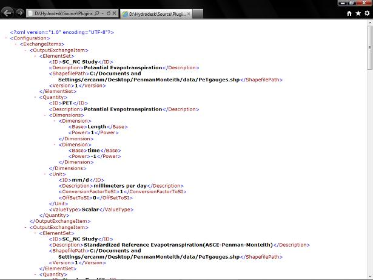

.. index:: config

config.xml file
===============

*Model configuration file when using Simple Model Wrapper*.  These files contain metadata for a model component including a description of the input and output exchange items including their units and unit conversion factors to SI.  The benefit of using a configuration file for a component is that when the data changes, components do not need to be recompiled.  Double-clicking these files will allow you to view them through Internet Explorer.  For simple viewing purposes, this is the suggested approach because it will color code the syntax, making the file much easier to read.  However, to edit the files, Notepad++ is the suggested approach because it is a free and powerful text editor. 

This is a configuration file opened using Internet Explorer.

|

This is a configuration file opened using Notepad++.

.. figure:: ./images/KeyTerms/HM_fig4m.png
   :align: center