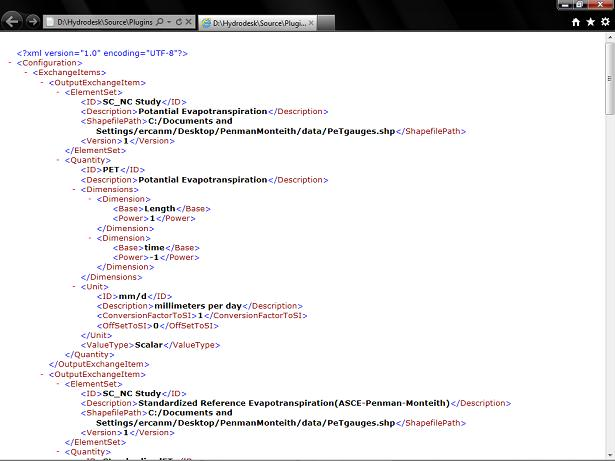
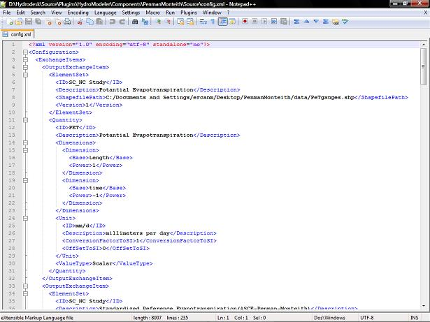

.. index:: config

config.xml file
===============

*Model configuration file when using Simple Model Wrapper*.  These files store all the information about the data, including a description of the data, it's conversion factor, and it's units.  The benifit to using configuration files is that when the data changes, components to not need to be recompiled.  Double Clicking these files will allow you to view them through Internet Explorer.  For simple viewing purposes, this is the best program to use because it will color code the syntax, making the file much easier to read.  However, internet explorer will not allow you to edit the files and you mush use a seperate program for editting.  Notpad is the best way to achieve this as it is free.  However, using just notepad makes it diffucult to view these files because there is no color coding, but there is an extened version of notepad you can download called Notepad++ which can be obtained here  http://notepad-plus-plus.org/download

This is a configuration file opened using Internet Explorer.

This is a configuration file opened using Notepad++.

