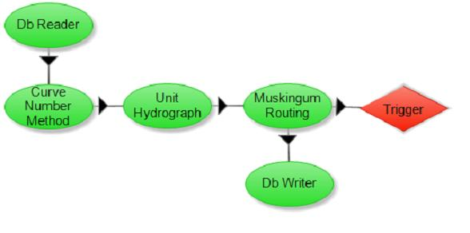

.. index:: opr

*.opr file
==========

*OpenMI project file*.  An OpenMI project file (or *.opr file) defines a linked composition of model components.  The opr file is an xml file and can be exited with any text editor.  It can also be run using a command line utility provided by the OpenMI Technical Association.  An image of an opr file vieed within HydroModeler is below.

