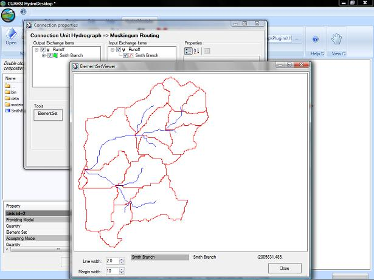

.. index:: shp

*.shp file
==========

*Shapefile.*  A shapefile is used to graphically describe geospatial data including points, polylines, or polygons that serve as an input to a model component.  A shapefile can be included in your configuration files and subsequently read by the HydroModeler plug in.  A .shp file is not required and is also not the only format that can be used, an alternative would be to use an ASCII file.  

This is an example of a .shp file that has been added to a configuration file.

.. figure:: ./images/KeyTerms/HM_fig5m.png
   :align: center

|

This is an example of a .shp files resulting image, created using HydroModeler's ElementSetViewer.

