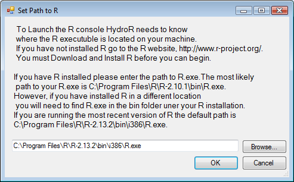

.. index:: Changing the R Version

Changing the R Version
======================

When you have multiple versions of **R**, you can check and change the version of R that is used by HydroR with the following steps:

1. Click the "Path to R" button on the HydroDesktop ribbon.  The following window will appear asking if you want to change the path to R.

2. Use the **Browse...** button to locate a different version of R on your computer.