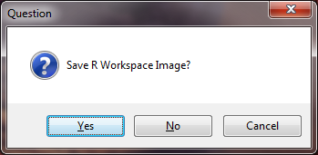

.. index:: Closing the R Console

Closing the R Console
=====================================================

When you are done using the R Console, you can close it using the following steps:

1. Click the "Close R" button on the HydroDesktop ribbon.  The following window will appear asking if you want to save the R Workspace Image.

2. Choose whether you want to save your R workspace image containing any R objects that you have loaded.