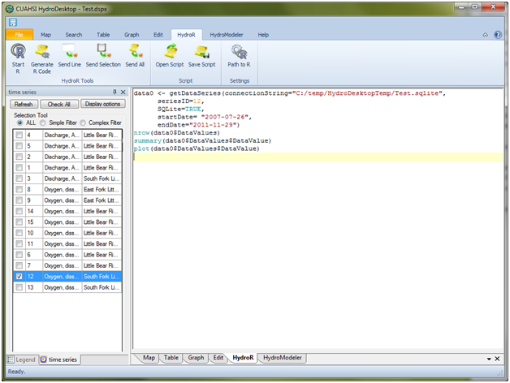

.. index:: Creating R Commands in the HydroR Script Editor

Creating R Commands in the HydroR Script Editor
=====================================================
  
Any command that can be executed within R can be typed into the HydroR script editor.  The following figure shows an R script that first loads a data series into an R List object and then determines the number of data values within the data series and some simple descriptive statistics of the data values.

