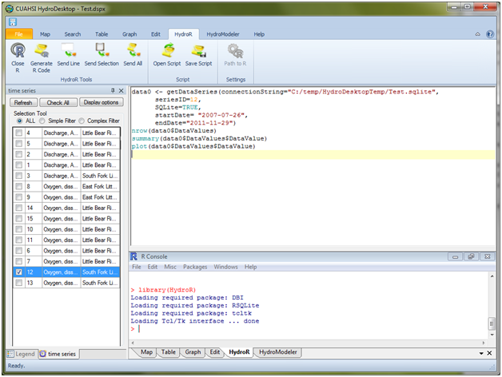
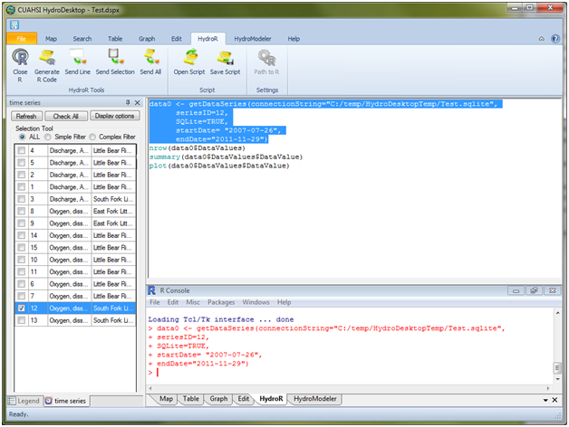

.. index:: Executing R Code from the HydroR Script Editor

Executing R Code from the HydroR Script Editor
=====================================================

Use the following steps to execute R commands from the HydroR script editor:

1. Open the R Console within HydroR by clicking on the "Start R" button on the HydroR ribbon.  You will notice that the R Console opens within the HydroR tab.

NOTE:  The first time you start the R console, you may get a pop-up dialog that asks you to navigate to the location of your R installation.  Follow the instructions on the form.  You may also have to choose a R CRAN Mirror site from which the HydroR extension will download a number of R packages to complete the installation.  Choose a CRAN mirror site that his near you and then click "OK."

2. On the HydroR ribbon, you will notice that there are three buttons for sending code from the HydroR script editor to the R console for execution:  1) Send Line, 2) Send Selection, and 3) Send All.  Send Line sends the currently selected line to the R Console, Send Selection sends all of the selected lines to the R Console, and Send All sends everything within the HydroR script editor to the R Console.  Select a number of lines by clicking and dragging in the script editor and then click the "Send Selection" button to send them to the R console.

3. You will notice that the lines from the script editor are sent to the R console and executed.