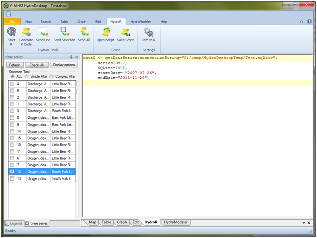

.. index:: Loading Data Series Into R from HydroDesktop

Loading Data Series Into R from HydroDesktop
=====================================================

Once you have discovered and downloaded some time series data into HydroDesktop, you can use the following steps to begin loading any of those time series into R for analysis:

1. Select any of the data series shown in the HydroDesktop Series Selection tool by clicking on the check box to the left of the data series.
2. Click the "Generate R Code" button on the HydroR ribbon.  You will notice that new lines of R code have been added to the HydroR script window.  These lines of code can be executed by the R console to load the selected data series from the HydroDesktop data repository database into R as an R List object.  In the following example, a single data series has been selected and will be loaded into an R List object called "data0."

