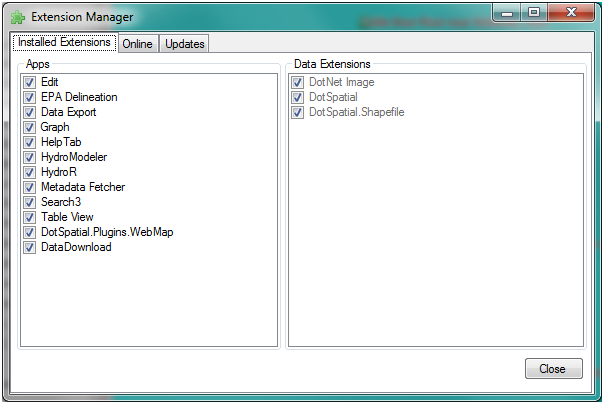
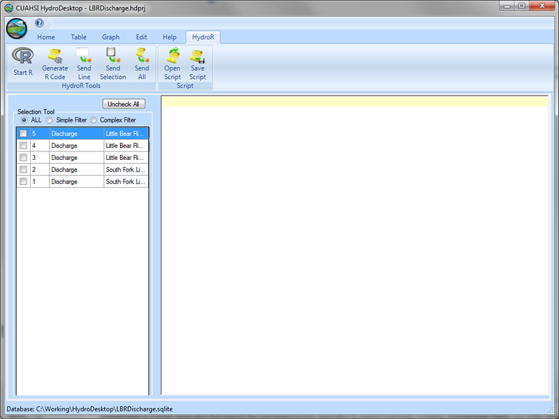

.. index:: Opening the HydroR Extension

Opening the HydroR Extension
=====================================================
  
Follow the steps below to open the HydroR extension within HydroDesktop:

1. If you don't have HydroDesktop open already, open it by clicking on Start / All Programs / CUAHSI HIS / HydroDesktop / HydroDesktop

2. Click on the Orb button at the top of the HydroDesktop window and then click on the small arrow to the right of "Extensions" to show the list of available HydroDesktop Extensions.

3. Click on "HydroR" in the list of extensions to load HydroR.  You will notice that a new tab called "HydroR" has been added to the HydroDesktop Window.

4. Click on the "HydroR" tab to access its functionality.  The following window shows the HydroR tab.

