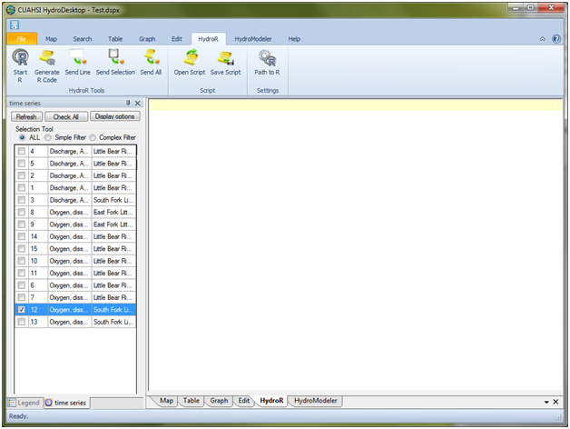

.. index:: Opening the HydroR Extension

Opening the HydroR Extension
=====================================================
  
Follow the steps below to open the HydroR extension within HydroDesktop:

1. If you don't have HydroDesktop open already, open it by clicking on Start / All Programs / CUAHSI HIS / HydroDesktop / HydroDesktop

2. The HydroR extension is loaded by default, but if you do not see a HydroR tab at the top of your HydroDesktop window, click on the "File" tab at the top of the HydroDesktop window and then click on "Extension Manager" to show the list of available HydroDesktop Extensions.

3. Make sure that the box next to the HydroR extension is checked and then click the "Close" button.  You will notice that a new tab called "HydroR" has been added to the HydroDesktop Window.

4. Click on the "HydroR" tab to access its functionality.  The following window shows the HydroR tab.

