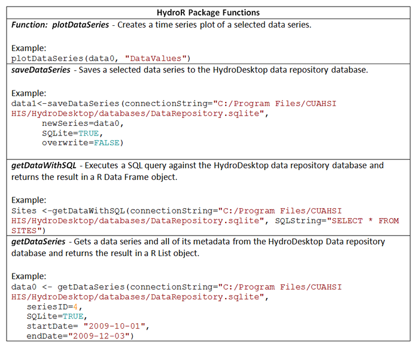

.. index:: R Commands Indluded in the HydroR Package for R

R Commands Indluded in the HydroR Package for R
=====================================================

The HydroR package for R, which is used by the HydroR extension for HydroDesktop, includes a number of useful functions for interacting with hydrologic time series data stored within the HydroDesktop data repository database.  The following table describes the included functions and shows example s of the included commands.  

