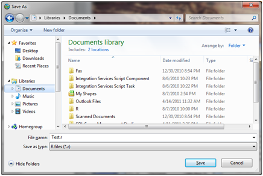
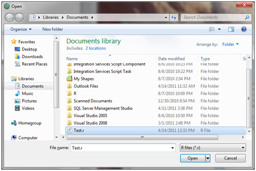

.. index:: Saving R Scripts and Opening Them Later

Saving R Scripts and Opening Them Later
=====================================================

Follow the steps below to save a script that you have written in the HydroR script editor to your hard disk for later use:

1. Click on the "Save Script" button on the HydroR ribbon.  A file dialog window will open asking you where you want to save your script.

2. Select a location on disk to save your file and then provide a file name.  The file will be stored as a text file with a ".r" extension.  Click the "Save" button.

3. To open a script that you have saved to your hard disk, click the "Open Script" button on the HydroR ribbon.  The file dialog window will open asking you where your R script is located on your hard disk.

4. Navigate to your R script that you have saved and select it in the file dialog box.  Then click the "Open" button.  Your saved script will be loaded into the HydroR script editor.