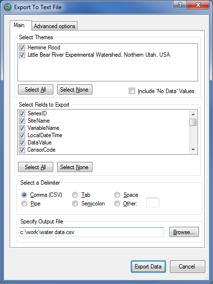

.. index:: 
   single: data, time series export
   single: time series export
   single: exporting time series data

Time Series Data Export
=======================

HydroDesktop can export your time series data to delimited text files for use
in other programs.  This is useful when HydroDesktop does not include all of
the analysis capabilities needed, or when the user prefers to work with
downloaded data in another program.

How To Export Data
------------------

Time series can be exported using a number of workflows.  In addition, users
familiar with SQLite can access the time series database directly.  The
database is typically located in the same directory where you saved your
project.

Exporting using the Data Export Tool
''''''''''''''''''''''''''''''''''''

On the *Table* tab of the ribbon, click the **Export** button to invoke the
data export dialog.

Exporting from the Series Selector
''''''''''''''''''''''''''''''''''

In views such as table view or graph view, a series selector shows a list of
time series on the left side of the display.  To export a time series,
right-click the time series in the series selector and click **Export Series**.

Exporting from the Map Legend
'''''''''''''''''''''''''''''

In views such as map view, a legend shows a list of map layers on the left side
of the display.  If a data search or download has been performed, a group layer called
*Data Sites* will be included in the legend, with each layer in this group
symbolized by data source.  Layers with downloaded data will include a box drawn
around the site symbol.

To export downloaded data for a given data source, right-click the layer name
for that data source, point to **Data**, and click **Export Time Series Data**.

Export Options
--------------

When exporting time series data, a dialog like the one below provides options
for the data export.

Time Series Export Dialog

This dialog allows the user to set the following options:

* Which themes will be included
* Whether or not 'No Data' values will be included.
* Which fields will be included to describe each time series value
* Which delimiter will be used to separate field values
* Output file name and location

.. note:: When exporting individual time series using the series selector, not all export options may be available.

After clicking **Export Data** in the dialog, the time series data are exported
to a text file.  You can close the dialog once the export is complete.