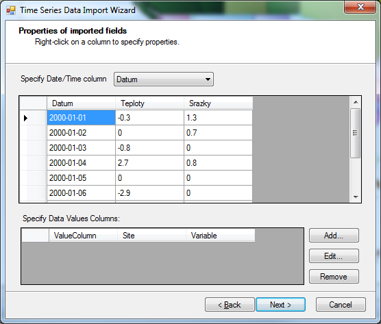
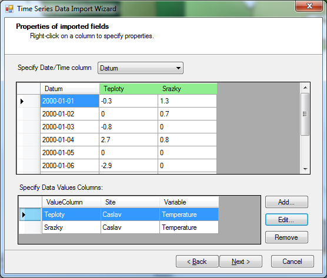

.. index:: 
   single: data, time series import
   single: time series import
   single: importing time series data
   single: data import

Time Series Data Import
=======================

HydroDesktop can import time series data from delimited text files and from
Microsoft Excel files.  This is useful when some of the data for your analysis
is not available online and when you want to use HydroDesktop to compare the
online downloaded data with your own data.

How To Import Data
------------------

Time series can be imported using the data import tool.  In addition, users
familiar with SQLite can modify the time series database directly.  The
database is located in the same directory where you saved your
project.

Importing using the Data Import Tool
''''''''''''''''''''''''''''''''''''

On the *Table* tab of the ribbon, click the **Import** button to invoke the
data import dialog.
In the first step, select the file to import. The file must be an Excel, CSV,
WaterML or text file with at least two columns: Time and Value. The file can
contain a single time series (one variable at one site) or multiple time series
(several variables and / or several sites).

Format Options
--------------

For correct data import of text files, it is necessary to set up the format options.
Typically the text files use the delimited format options with one of the following separators:
Comma, Tab, Space, Pipe or Semicolon.

Properties of Imported Fields
-----------------------------

The imported file must contain one Date/Time column. The system will try to select this column
automatically. For all other columns that you wish to import, the properties must be specified.
These properties are: Site, Variable, Source, Method, Quality Control and Offset. The Site and
Variable properties are required. If your cureent Hydrodesktop project already contains data, 
you may select an existing site or an existing variable. Otherwise, use the Create new... button
to specify a new site.

Time Series Import Dialog

Time Series Properties of imported columns