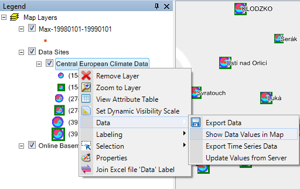
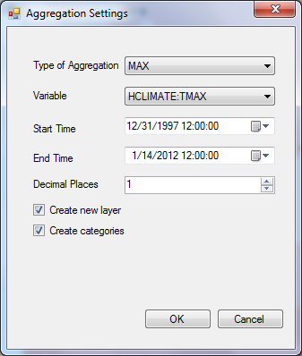
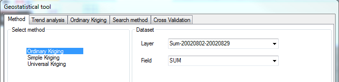
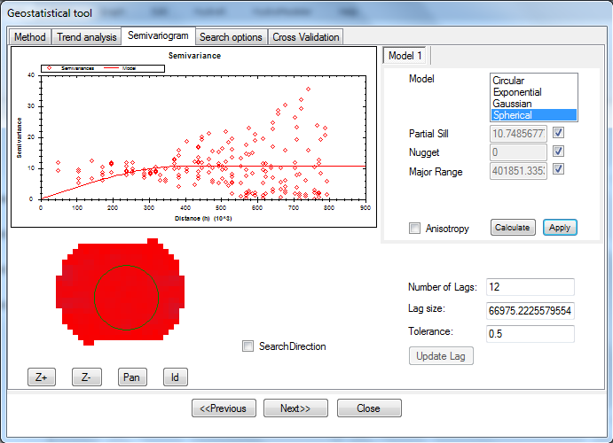
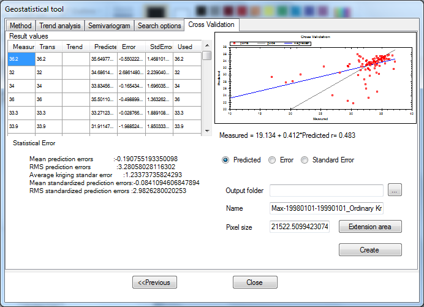
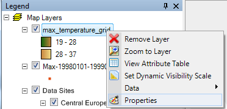
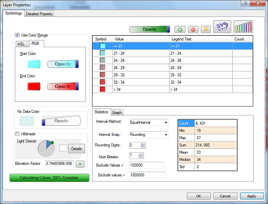
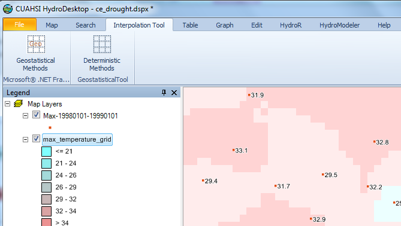

.. index:: Interpolation

Interpolation Tool
==================

Creating Interpolated Maps
--------------------------

After you downloaded or imported time series data into HydroDesktop, you can use the interpolation tool to calculate data values 
at points without observations and to create continuous interpolated maps. The interpolation tool takes values at sampling points 
(data sites), examines the spatial relationship between the points and their values (are nearby points more likely to have similar 
value?), creates a regular raster (grid) and calculates a new data value at each point of the grid. 

#. :ref:`Data aggregation <interpolation-data-aggregation>`
#. :ref:`Interpolation - apply interpolation method <interpolation-methods>`
#. :ref:`Set color scheme of interpolated map <interpolation-set-color-scheme>`

In the data aggregation step you select a time period and the aggregation statistic: maximum, minimum, average or sum. The data
aggregation step is necessary, because for each site (station) there are multiple observations. 
The observations at each station are not always at synchronous times. The data aggregation step ensures that for each station
there will be a representative data value for the selected period. If a station has no data values within the period, then it is 
excluded from the interpolation.

.. _interpolation-data-aggregation:

Data Aggregation
----------------

To start the data aggregation step:

#. Go to the map tab.
#. Right-click on the Data layer in the map legend
#. In the context menu select Data – Show Data Values In Map. The picture below shows this step.

Data Aggregation Settings
'''''''''''''''''''''''''

The data aggregation settings dialog selects the type of aggregation, time period, and other options.
The options are explained here:

Select the aggregation settings in the dialog window

The aggregation settings are:

#. Type of aggregation: specifies, how the value is calculated at each site. the options are MAX (maximum), MIN (minimum), AVG (average), SUM (the sum)
#. Variable: this shows the variable code. This is the type of the observation. You can look up more information about variable by right-clicking a time series in the graph or table tabs.
#. Start time: beginning time of the aggregation. By default this is the earliest observation data point for the selected data sites layer.
#. End time: ending time of the aggregation. By default this is the latest observation data point for the selected data sites layer.
#. Decimal places: number of decimal places (rounding of calculated values). Use this option to control the map display of the data values.
#. Create new layer: If checked, this will create a new layer to the map. This layer has the column with the calculated value and a column PercAvailable that indicates the percentage of valid observation data points within the selected period at the station.
#. Create categories: If checked, then the points will be shown as circles with different sizes proportional to the aggregated data value.

.. note:: Observations with unknown value ('NoData value, usually coded as -9999) are excluded from the aggregation.

.. _interpolation-methods:

Interpolation Methods
---------------------

Two types of interpolation methods are available in the interpolation tool tab: **Geostatistical methods** and **Deterministic methods**.

Interpolation - Geostatistical Methods
''''''''''''''''''''''''''''''''''''''

The first step in interpolation is selecting the layer and selecting a field. This is the column in the attribute table that
has the data values. 

.. note:: Only point layers that have a column with numeric values and at least 7 points are shown in the list.

Interpolation - Semivariogram
'''''''''''''''''''''''''''''

The next step is viewing the semi-variogram. This graph shows the statistical relationship between distances of point pairs
and the semi-variance of point values.

Interpolation - Cross-Validation
''''''''''''''''''''''''''''''''

The next important step is cross-validation. For randomly selected points, the point is excluded from the dataset and its value is calculated
using the interpolation method. It is then compared to the original value. Cross-validation provides information about error
introduced by the interpolation.

Interpolation - Set Output Extent
'''''''''''''''''''''''''''''''''

In the last step you have an option to set the "Extension area". Use this option when you need to extrapolate values outside
of the bounding box of the data points.

Interpolation - Deterministic Methods
'''''''''''''''''''''''''''''''''''''

Instead of geostatistical methods, you can also use the deterministic method: inverse distance weighted, radial basis function,
local polynomial or global polynomial. Follow the steps to complete the interpolation

.. _interpolation-set-color-scheme:

Setting the interpolated map color scheme
-----------------------------------------

#. Change the color scheme of the raster: 
#. Right click on the layer in the map legend table of contents and select Properties. 
#. Change the color ramp to RGB, set Start Color to light blue, End Color to dark blue and set number of breaks to 5 (Num Breaks in the “Statistics” tab). 
#. Click the “OK” button. This will re-color your raster data map to represent five different levels of precipitation. 

Interpolated layer color scheme setting

Display the final map
'''''''''''''''''''''

The final interpolated map