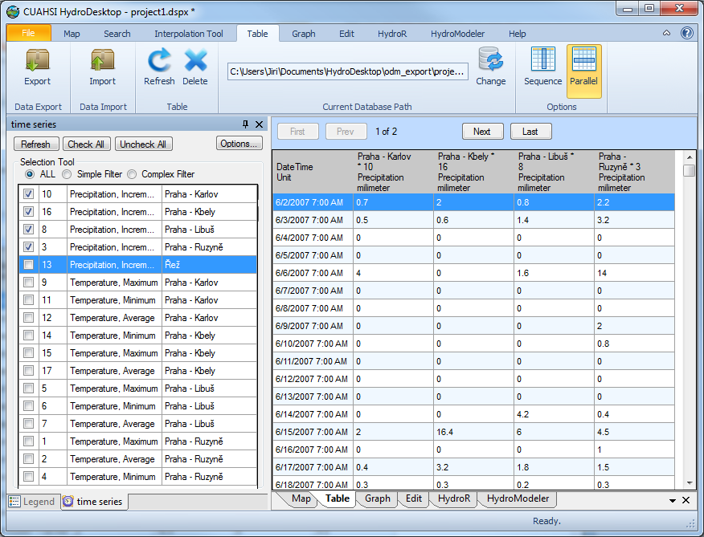

.. index:: Table tab

Table Tab
===========
  
The Table Tab in HydroDesktop provides functions to view and export time series data.
You can also change the current database and build your own local metadata cache
using the tools on this tab.  

   Table tab

For more information on exporting time series data, see :doc:`/guide-books/ExportingTimeSeries/time-series-export`.

For more information on the local metadata cache, see :doc:`/extensions/MetadataFetcher/MetadataFetcher`.

For more information on the current database path and working with databases, see
:doc:`/working-with-databases`.