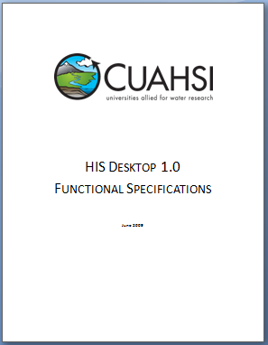

[Getting HydroDesktop](Getting-HydroDesktop), [Presentations and Publications](Presentations-and-Publications), [Functional Specifications](Functional-Specifications), [Database Structure](Database-Structure), [Sample Data](Sample-Data), [Workshops and Training](Workshops-and-Training)
----
# HydroDesktop Functional Specifications

Version 1.0 of the HydroDesktop (HIS Desktop) Functional Specifications was released by the CUAHSI HIS project team in June 2009. 

Download the document here: [HISDesktopFunctionalSpecifications.pdf](Functional Specifications_HISDesktopFunctionalSpecifications.pdf)

This document gives an overview of the project and describes in some detail the key functions that are to be included in the first full release of the software. 

**Table of Contents**

1. Introduction	
1.1 Intended Use	
1.2 Target Users for HIS Desktop	
2. High Level Design	
3. Features and Functional Requirements	
3.1.	Data Discovery	
3.1.1.	Data Discovery Using the HIS Central Metadata Catalog	
3.1.2.	Data Discovery Directly From WaterOneFlow Web Services	
3.1.3.	Data Discovery for Thematic Datasets	
3.1.4.	Processing of Search Results	
3.1.5.	Work Flow for Data Discovery	
3.2.	Data Download	
3.2.1.	Downloading Observational Data	
3.2.2.	Downloading GIS Datasets	
3.2.3.	Work Flow for Data Download	
3.3.	Data Visualization	
3.3.1.	Visualization and Analysis of Spatial Data	
3.3.2.	Visualization and Analysis of Observational Data	
3.3.3.	Work Flow for Visualizing Observational Data	
3.4.	Data Import and Export	
3.4.1.	Importing and Exporting Spatial Datasets	
3.4.2.	Importing and Exporting Observational Datasets	
3.4.3.	Work Flow for Data Import and Export	
3.5.	Project Workspace	
3.5.1.	Work Flow for Creating a Project Workspace	
3.6.	Plug-in Interface	
4.	Technical Requirements	
4.1.	Development Environment and Source Code	
4.2.	Operating System Support	
4.3.	Database Support	
4.4.	Third Party Software Components	
4.5.	User Interface Requirements	
4.6.	Installation and Configuration	
5.	Interfaces and Dependencies	
6.	Community Code Development System and Management	
6.1.	HIS Desktop Web Site	