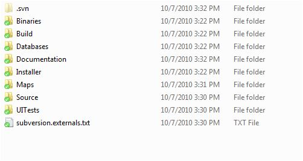
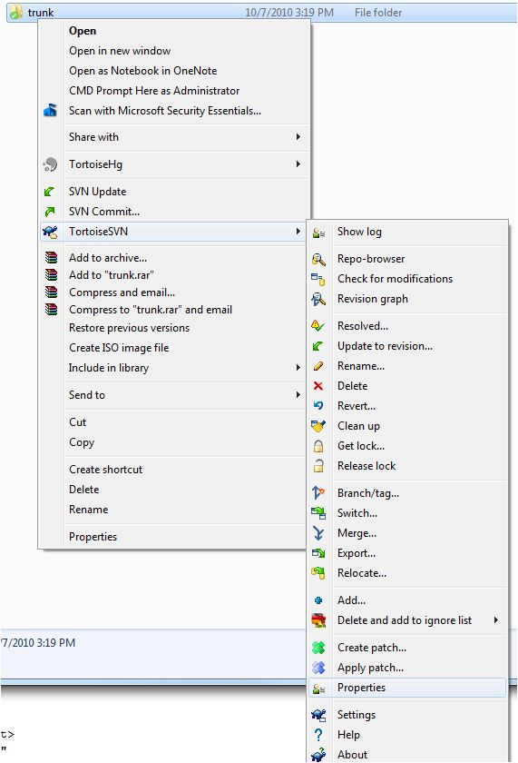
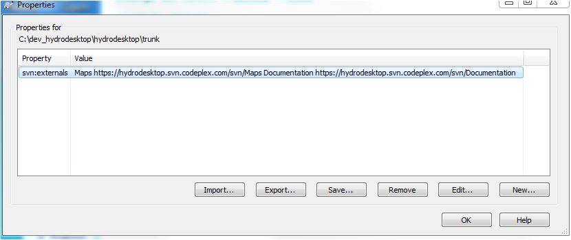

# Checking out the Working Source code branch
In order to work with HD, you will check out "hydrodesktop/trunk"

**If you check out the top level, use OMIT EXTERNALS** or you will get a loop

These directories will be created :
* Maps (from Maps)
* Documentation (from Documentation)
* Binaries (from hydrodesktop/trunk/Binaries)
* Databases (from hydrodesktop/trunk/Databases )
* Installer (from hydrodesktop/trunk/Installer )
* Source (from hydrodesktop/trunk/Source)

===
In order to work with a branch checkout 
* hydrodesktop/branch/BRANCHNAME

### the trunk uses Subvserion externals
A file with the lines:
{{
Maps https://hydrodesktop.svn.codeplex.com/svn/Maps
Documentation https://hydrodesktop.svn.codeplex.com/svn/Documentation
}}

This command was 
_svn propset svn:externals -F subversion.externals.txt . _

To see this, click on the trunk

