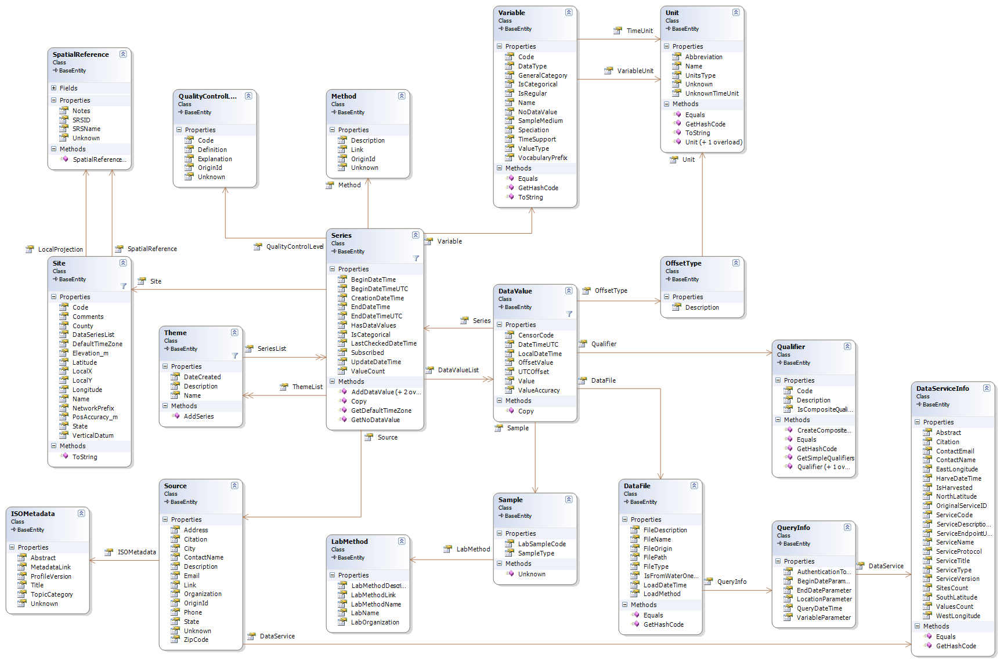

# HydroDesktop Object Model
The HydroDesktop object model is a set of classes which can be used by the main HydroDesktop application and plug-ins. The classes are a simplified model. The following classes are used in the object model:
* DataFile
* DataValue
* [DataServiceInfo](DataServiceInfo)
* ISOMetadata
* LabMethod
* Method
* OffsetType
* Qualifier
* QualityControlLevel
* QueryInfo
* Sample
* [Series](Series)
* Site
* Source
* SpatialReference
* Theme
* Unit
* Variable

The following class diagram shows the main classes and associations between them.
