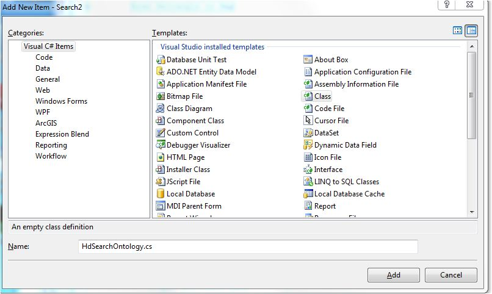
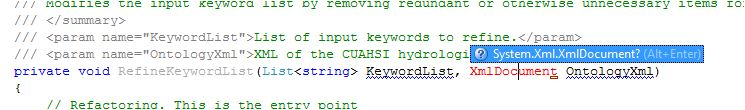
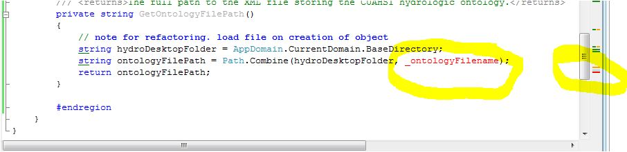
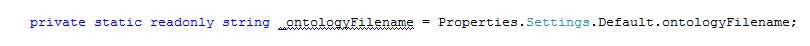
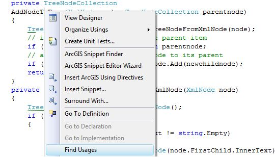
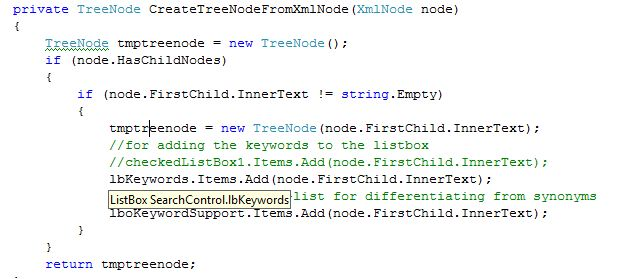
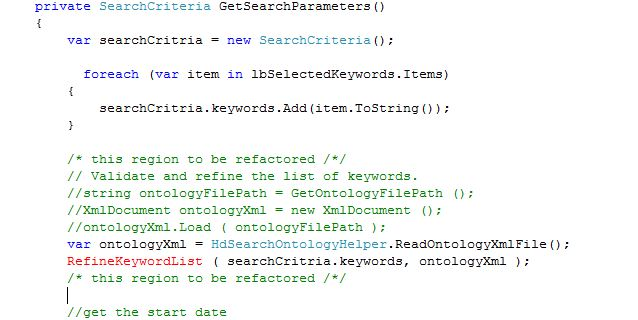

In this step we are refactoring the ontology methods into a new class:

* Create a new class, HdSearchOntologyRefinement.cs 
* copy over the ontology method from the SearchControl.cs to the new 
* I am using JetBrains Resharper, so I add the using fo using resharper 
* I note that one line appears to have an error 
	* the GetOntologyFilePath()  has a dependency on the ontology file name.
* We will remove the dependency using a setting (so that the file can be renamed in the future)
	* open SearchControl.cs, find _ontologyFilename. 
	* It already is a setting, so just comment out, and move to the HdSearchOntologyRefinement.cs 
* Note that when I comment it out, another line goes red. 
{code:c#}
  
            {
                //txtFilename.Text = filename;
                treeviewOntology.Nodes.Clear();
                XmlDocument tmpxmldoc = new XmlDocument();
				tmpxmldoc.Load ( Application.StartupPath + "\\" + _ontologyFilename );
                FillTree(tmpxmldoc.DocumentElement, treeviewOntology.Nodes);
            }
{code:c#}
	* note that in the code there are two places where the same file is read into an xml document. 
	* We found a location where a fixed filename is used.
 {{tmpsyndoc.Load(Application.StartupPath + "\\Synonyms.xml");}}
	* And, we have found another candiate for refactoring. We might consider moving these into the HdSearchOntologyRefinement.cs
{{
private void FillTree(XmlNode node, TreeNodeCollection parentnode)
}}
* Let's add a new setting, and for now, a static variable 
	* open settings.settings (in your projects, you might have to open the project properties, and add a settings file) 
	* Add a private variable
{{ private static readonly string _ontologySynonymsFilename = Properties.Settings.Default.synonymsFilename;
}}
	* Modify the code, and make it correct to use the Path.Combine which will make it platform independent.
{{           tmpsyndoc.Load(Path.Combine(Application.StartupPath, _ontologySynonymsFilename));
}}
* Determine if AddNodeToTree is candidate for refactoring
	* FindUSages on  AddNodeToTree is used 
	* It goes directly to the method, so there is one usage. If there are multiple usages, it will show a list 
		* We look at the method that this calls CreateTreeNodeFromXmlNode(XmlNode node)
			* it modifies the UI. so this is not a good case for refactoing.
* But, we should refactor this so that the file(s) are read by only one class
{code:c#}
   public  class HdSearchOntologyHelper
    {
        private static readonly string _ontologyFilename = Properties.Settings.Default.ontologyFilename;
        private static readonly string _ontologySynonymsFilename = Properties.Settings.Default.synonymsFilename;

		public  static XmlDocument ReadOntologyXmlFile()
       {
           
       }
       public  static XmlDocument ReadOntologyXmlFile(string filename)
       {

       }
       public  static XmlDocument ReadOntologySymbologyXmlFile()
       {

       }
       public  static XmlDocument ReadOntologySymbologyXmlFile(string fileanme)
       {

       }
       public  static XmlDocument ReadXmlFile(string fileanme)
       {

       }
{code:c#}

Fill the methods in
{code:c#}
 public static XmlDocument ReadOntologyXmlFile()
       {
           return ReadXmlFile(_ontologyFilename);
       }
       public static XmlDocument ReadOntologyXmlFile(string filename)
       {
           return ReadXmlFile(filename);
       }
       public static XmlDocument ReadOntologySymbologyXmlFile()
       {
           return ReadXmlFile(_ontologySynonymsFilename);
       }
       public static XmlDocument ReadOntologySymbologyXmlFile(string filename)
       {
           return ReadXmlFile(filename);
       }
       private static XmlDocument ReadXmlFile(string filename)
       {
           XmlDocument tmpxmldoc = new XmlDocument();
           tmpxmldoc.Load(Path.Combine(Application.StartupPath, filename));
           return tmpxmldoc;
       }
{code:c#}

Now refactor in SearchControl.cs

{code:c#}
 private void button10_Click(object sender, EventArgs e)
        {
            try
            {
                //txtFilename.Text = filename;
                treeviewOntology.Nodes.Clear();
                //XmlDocument tmpxmldoc = new XmlDocument();
                //tmpxmldoc.Load ( Path.Combine(Application.StartupPath,_ontologyFilename ));
                var tmpxmldoc = HdSearchOntologyHelper.ReadOntologyXmlFile();
                FillTree(tmpxmldoc.DocumentElement, treeviewOntology.Nodes);
            }
            catch (Exception ex)
            {
                tboTypeKeyword.Text = ex.Message;
            }
            //adding synonyms to listbox1
           // XmlDocument tmpsyndoc = new XmlDocument();
            //tmpsyndoc.Load(Path.Combine(Application.StartupPath, _ontologySynonymsFilename));
            var tmpsyndoc = HdSearchOntologyHelper.ReadOntologySymbologyXmlFile();
            XmlNodeList nList = tmpsyndoc.GetElementsByTagName("SearchableKeyword");
            foreach (XmlNode nod in nList)
            {
                XmlElement elem = (XmlElement)nod;
                if (lbKeywords.Items.Contains(elem.InnerText) == false)
                {
                    lbKeywords.Items.Add(elem.InnerText);
                }
            }
        }
{code:c#}
Wait, discover that Smboology.xml is read from a different location:
{code:c#}
 private void listBox1_MouseUp(object sender, MouseEventArgs e)
        {
            tboTypeKeyword.Text = "";
            int keyIndex = lbKeywords.IndexFromPoint(e.Location);
            string strNode = lbKeywords.Items[keyIndex](keyIndex).ToString();
            //check for synonym
            //XmlDocument doc = new XmlDocument();
            //doc.Load(Application.StartupPath + "\\Synonyms.xml");
            var doc = HdSearchOntologyHelper.ReadOntologySymbologyXmlFile();

            XmlNodeList nList = doc.GetElementsByTagName("SearchableKeyword");

            foreach (XmlNode node in nList)
            {
                if (node.InnerText.ToLower() == strNode.ToLower())
                {
                    tboTypeKeyword.Text = node.NextSibling.InnerText;
                    FindInTreeView(treeviewOntology.Nodes, tboTypeKeyword.Text);
                }
            }
            //check ends
            if (tboTypeKeyword.Text == "")
            {
                tboTypeKeyword.Text = lbKeywords.Items[keyIndex](keyIndex).ToString();
                FindInTreeView(treeviewOntology.Nodes, tboTypeKeyword.Text);
            }
        }
{code:c#}

And finnaly the orginal location:
{code:c#}
       //Run the Search
        private SearchCriteria GetSearchParameters()
        {
            var searchCritria = new SearchCriteria();

              foreach (var item in lbSelectedKeywords.Items)
            {
                searchCritria.keywords.Add(item.ToString());
            }

            /* this region to be refactored /*/
			// Validate and refine the list of keywords.
            //string ontologyFilePath = GetOntologyFilePath ();
            //XmlDocument ontologyXml = new XmlDocument ();
            //ontologyXml.Load ( ontologyFilePath );
            var ontologyXml = HdSearchOntologyHelper.ReadOntologyXmlFile();  
			RefineKeywordList ( searchCritria.keywords, ontologyXml );
            /* this region to be refactored /*/
		}
{code:c#}
The refactored method RefineKeywordList is flagged as red 

Go into: HdSearchOntologyHelper.cs

make RefineKeywordList public 
{{
        public void RefineKeywordList(List<string> KeywordList, XmlDocument OntologyXml)
}}
Now let's use this:
{{          var ontologyHelper = new HdSearchOntologyHelper();
            ontologyHelper.RefineKeywordList(searchCritria.keywords, ontologyXml);
}}
 
 Now let's build the project 
 
 Next step is to futher refactor, and create tests